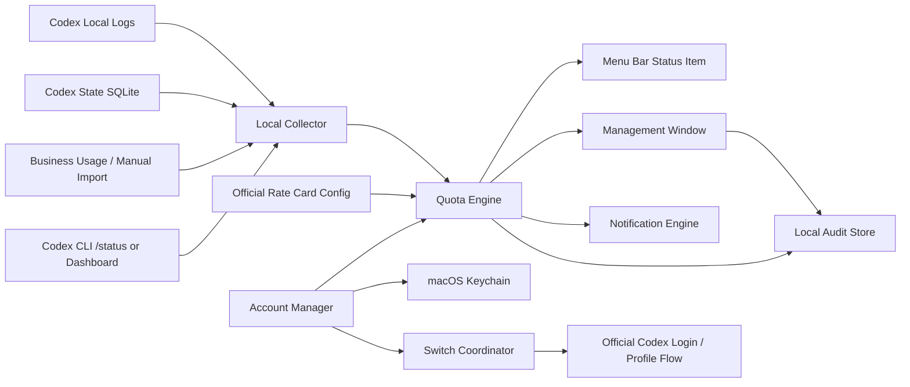
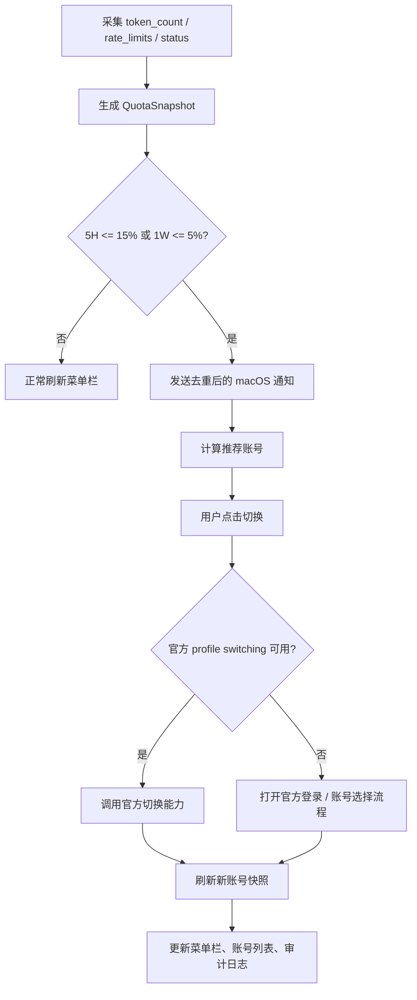

# Codex 多账号配额管理产品需求分析

文档编号：REQ-001  
文档状态：草案  
生成时间：2026-05-01  
最后更新：2026-05-03  
目标平台：macOS  
产品形态：macOS 菜单栏常驻应用 + 管理窗口  
建议产品名：Codex Quota Manager  
汇报长图：`REQ-001-codex-multi-account-quota-management-report-long-image.png`  
关联文档：BKG-001、PRD-001、TECH-001、DEV-001、VAL-001

> 本文是需求分析与产品细化，不是最终技术承诺。涉及 ChatGPT Business、Codex 配额、OAuth、账号切换的能力，需要以 OpenAI 官方文档、实际客户端行为和企业合规要求为准。

## 0. 本次核对结论

本需求方向成立，但需要把“多账号额度治理”与“规避官方限制”明确区分。产品应定位为本机菜单栏配额监控、低额度提醒、账号推荐和用户确认式切换工具，不承诺后台无感轮换或无限额度。

本次核对后的关键口径：

- 状态栏必须显示当前账号 5 小时、1 周额度剩余比例。
- 5 小时额度剩余低于 15% 时发送通知提醒。
- 1 周额度剩余低于 5% 时发送强提醒。
- 详情面板和管理窗口必须显示 token 用量，单位统一为 `M tokens`。
- credits 估算按官方 Codex rate card 的 credits / 1M tokens 逻辑计算。
- 用户可以手动切换账号；切换完成后必须刷新并展示新账号额度。
- 官方 profile switching API 尚未确认，MVP 应采用用户确认的官方登录/切换流程或可验证的 profile 隔离方案。

## 1. 背景

用户存在多个 ChatGPT Business / ChatGPT Plus / Codex 可用账号或 workspace，希望在使用 Codex 客户端时，实时知道当前 5 小时额度和 1 周额度的消耗情况。当额度接近耗尽，尤其 5 小时额度剩余低于 15%、1 周额度剩余低于 5% 时，系统能提醒并帮助切换到仍有额度的账号，减少长任务中断。

本产品需要运行在 macOS 上，并可以分发给有同类需求的人员使用。用户期望它类似菜单栏网络速率工具一样，在 macOS 顶部菜单栏展示一个小型状态提示，点击后可以查看配额并切换账号。

## 2. 产品定位

Codex Quota Manager 是一个面向 Codex 重度用户和企业 IT 管理者的 macOS 配额治理工具。

它解决的问题不是“绕过额度”，而是：

- 监控当前 Codex 使用中的 5 小时和 1 周额度窗口。
- 估算当前账号的 token / credits 消耗趋势，并按官方 rate card 的每百万 token 口径展示。
- 在菜单栏中给出轻量、常驻、可感知的额度提示。
- 在 5 小时额度剩余低于 15% 或 1 周额度剩余低于 5% 时提醒用户，并推荐可用账号。
- 通过用户确认的方式切换到另一个已授权账号，切换完成后立即刷新新账号额度。
- 为个人或团队提供账号维度、任务维度、模型维度的用量明细。

## 3. 合规边界

### 3.1 可以做

- 使用用户主动授权的账号。
- 读取本机 Codex 客户端产生的本地 token / rate limit 日志。
- 读取 ChatGPT Business 管理后台或官方可用接口提供的 workspace 级用量信息。
- 在 macOS 菜单栏展示配额剩余、消耗趋势和阈值提醒。
- 在用户点击确认后，执行官方支持的账号切换、重新登录或 profile 切换流程。
- 将 OAuth token、刷新 token、账号凭证类敏感数据存储在 macOS Keychain。
- 对切换动作、配额采集动作和导出动作做本地审计。

### 3.2 不应做

- 不应后台无感轮换多个账号来规避 OpenAI 的使用限制或组织策略。
- 不应篡改、复制、共享 OAuth token、浏览器 cookie 或 Codex 客户端内部凭证。
- 不应把一个人的账号额度池化给其他人使用。
- 不应采集、上传或展示聊天内容、代码内容、私有仓库内容，除非用户明确打开相应功能。
- 不应承诺能获取官方没有开放的数据，例如跨设备、跨客户端、跨 workspace 的完整个人明细。

### 3.3 切换账号的产品原则

默认采用“用户触发的一键切换”，而不是“后台静默自动切换”。

推荐交互：

```text
5 小时额度剩余 <= 15% 或 1 周额度剩余 <= 5%
-> 菜单栏变红并通知
-> 点击菜单栏状态项
-> 系统推荐一个可用账号
-> 用户点击“切换到该账号”
-> 产品调用官方支持的登录/profile 切换能力
-> 切换完成后刷新新账号的 5H / 1W 剩余和 token / credits 用量
-> 记录审计日志
```

如果未来 OpenAI / Codex 官方提供明确的 profile switching API，可以在企业策略允许的前提下加入“自动切换前弹出确认”或“可信策略自动切换”。

## 4. 官方信息依据

截至 2026-05-03，本需求分析引用以下官方口径：

| 主题 | 官方口径摘要 | 来源 |
|---|---|---|
| Codex credits | Codex 已按 input tokens、cached input tokens、output tokens 折算 credits，单位为 credits / 1M tokens，而不是简单按任务数固定扣减 | https://help.openai.com/en/articles/20001106-codex-rate-card |
| Codex pricing / usage limits | Plus 与 Business 展示 5 小时窗口；local messages 与 cloud tasks 共享 5 小时窗口，且可能存在额外周限制；可在 Codex usage dashboard 查看当前限制，CLI 活跃会话可用 `/status` 查看剩余额度 | https://developers.openai.com/codex/pricing |
| ChatGPT Business credits | Business workspace 可购买 credits、设置自动充值和 spend controls，并可查看 usage analytics；2026-04-02 后 Business 支持 standard ChatGPT seats 与 usage-based Codex seats | https://help.openai.com/en/articles/20001155-managing-credits-and-spend-controls-in-chatgpt-business |
| Codex 使用限制 | 额度消耗会受任务规模、代码库上下文、长会话、执行位置影响；达到限制后需等待窗口重置或使用额外 credits / API key | https://help.openai.com/en/articles/11369540-using-codex-with-your-chatgpt-plan |
| 本地 Codex 使用明细 | Codex web / cloud usage 可进入 Compliance API；local environments usage 不进入 Compliance API，因此本地日志采集仍有必要 | https://help.openai.com/en/articles/11369540-using-codex-with-your-chatgpt-plan |
| Codex 认证 | Codex 支持 ChatGPT 登录和 API key 登录；CLI / IDE 会缓存登录状态，官方支持 credential store / keyring 配置 | https://developers.openai.com/codex/auth |

当前未确认到官方公开的“第三方应用直接切换 Codex 客户端登录 profile”的稳定 API。因此账号切换能力必须设计成可插拔：优先用官方能力，缺失时采用打开登录流程、指导用户切换或隔离 profile 的工程方案。

## 5. 目标用户

| 用户类型 | 典型诉求 |
|---|---|
| Codex 重度个人用户 | 需要知道当前 5 小时和 1 周额度还剩多少，避免长任务中断 |
| 企业 IT 管理者 | 需要掌握多个 Business workspace / seat 的 Codex 消耗，控制预算和合规风险 |
| 开发负责人 | 希望分配高强度 Codex 使用账号，查看成员或项目的消耗趋势 |
| 被分发使用者 | 希望安装后能快速登录自己的账号，看到自己的额度和用量，不需要理解底层 token 计算 |

## 6. 核心场景

### 6.1 常驻查看额度

用户正在使用 Codex 客户端。macOS 菜单栏显示类似：

```text
Cdx 5H 55% 1W 82%
```

或在空间足够时显示为两段状态：

```text
5H 55% | 1W 82%
```

含义建议统一为“剩余额度百分比”，而不是“已用百分比”，便于用户直接判断风险。

### 6.2 点击菜单栏查看详情

用户点击菜单栏状态项后，弹出下拉面板：

- 当前账号：别名、workspace、邮箱掩码、seat 类型。
- 5 小时窗口：已用、剩余、预计重置时间。
- 1 周窗口：已用、剩余、预计重置时间。
- 当前任务消耗：本线程 / 本会话的 input、cached input、output、reasoning output、credits 估算。
- token 用量：按 `M tokens` 展示，例如 input 12.400M、cached input 8.250M、output 1.120M。
- 推荐账号：根据剩余额度、优先级、最近切换时间给出建议。
- 快捷操作：切换账号、打开管理窗口、导出明细、刷新数据。

### 6.3 低额度提醒

当剩余额度低于阈值时：

| 条件 | 菜单栏状态 | 动作 |
|---|---|---|
| 5H > 30% 且 1W > 30% | 正常 | 默认色，正常轮询刷新 |
| 5H 15% - 30% 或 1W 5% - 30% | 注意 | 黄色提示，菜单内展示消耗趋势 |
| 5H <= 15% 且 1W > 5% | 5 小时风险 | 橙色或红色状态，发送 macOS 通知，推荐可用账号 |
| 1W <= 5% | 周额度临界 | 红色状态，发送强提醒，建议切换到周额度更充足的账号 |
| 5H <= 5% 或 1W <= 2% | 执行风险 | 启动长任务前提示风险，需要用户确认继续 |

通知去重规则：

- 同一账号、同一额度窗口、同一阈值等级，在 30 分钟内只通知一次。
- 用户手动刷新或完成账号切换后，应重新计算阈值状态，但不重复发送同等级通知。
- 如果剩余比例从风险区间恢复到安全区间，再次跌破阈值时允许重新通知。

### 6.4 一键切换账号

用户点击菜单栏状态项，在账号列表里选择“切换到账号 B”。

系统应完成：

1. 检查账号 B 的 OAuth 授权是否有效。
2. 检查账号 B 的 5 小时 / 1 周额度是否满足切换策略。
3. 如果 Codex 客户端支持官方 profile switching，则调用官方能力。
4. 如果不支持，打开官方登录/切换流程，并提示用户完成确认。
5. 切换完成后立即刷新菜单栏状态、详情面板和账号列表中的新账号 5H / 1W 剩余比例。
6. 写入本地审计日志。

注意：这里的“一键”指用户点击一次触发切换流程，不代表后台静默替换凭证。

## 7. 功能范围

### 7.1 P0：MVP 必须支持

| 编号 | 功能 | 描述 |
|---|---|---|
| P0-1 | macOS 菜单栏状态项 | 常驻显示当前账号 5 小时和 1 周剩余额度 |
| P0-2 | 本地 Codex 日志采集 | 只读读取 `~/.codex/sessions/**/*.jsonl` 中的 token_count / rate_limits 事件 |
| P0-3 | 当前线程消耗统计 | 展示 total、input、cached input、output、reasoning output，并换算为 M tokens |
| P0-4 | credits 估算 | 按模型 rate card 的 credits / 1M tokens 折算当前任务和当前账号近似 credits |
| P0-5 | 多账号登记 | 维护账号别名、workspace、邮箱掩码、优先级、状态 |
| P0-6 | 阈值提醒 | 支持 5 小时剩余 15%、1 周剩余 5% 的通知提醒，并保留可配置阈值 |
| P0-7 | 点击式切换入口 | 菜单栏点击后展示账号列表和切换动作 |
| P0-8 | Keychain 存储 | OAuth / token 类敏感信息只能进入 macOS Keychain |
| P0-9 | 本地审计日志 | 记录登录、刷新、切换、导出、配置变更 |
| P0-10 | 管理窗口 | 提供账号管理、用量明细、策略设置、导出功能 |
| P0-11 | 切换后刷新 | 账号切换完成后强制刷新新账号配额、token 用量和推荐账号列表 |

### 7.2 P1：增强能力

| 编号 | 功能 | 描述 |
|---|---|---|
| P1-1 | Business workspace 用量接入 | 接入官方 usage analytics 或人工导入报表 |
| P1-2 | 多设备汇总 | 将多台 Mac 的本地摘要上传到企业内网服务进行汇总，不上传聊天内容 |
| P1-3 | 任务类型识别 | 按 Excel、代码、文档、PR review、长任务等分类统计 |
| P1-4 | 预算预测 | 按历史消耗预测本周、本月 credits 使用趋势 |
| P1-5 | 账号推荐策略 | 根据额度、优先级、业务用途、最近使用时间推荐账号 |
| P1-6 | MDM 分发 | 支持 Jamf、Mosyle、Intune 等 macOS 管理工具分发配置 |

### 7.3 P2：企业版能力

| 编号 | 功能 | 描述 |
|---|---|---|
| P2-1 | 中央管理后台 | 管理多个使用者、workspace、seat 和策略 |
| P2-2 | SSO / 企业身份集成 | 与企业 SSO、设备身份、人员组织架构关联 |
| P2-3 | 合规报表 | 输出按人、团队、项目、workspace 的月度报表 |
| P2-4 | 异常检测 | 识别异常高消耗、非工作时间大量消耗、频繁切换账号 |
| P2-5 | 审批流 | 高成本模型、低额度继续执行、跨 workspace 切换需要审批 |

## 8. 菜单栏交互设计

### 8.1 菜单栏展示

参考用户截图中的“实时速率”类菜单栏组件，本产品状态项建议采用可变宽度 `NSStatusItem`。

推荐展示样式：

```text
Cdx 5H 55% 1W 82%
```

空间较小时：

```text
Cdx 55/82
```

风险态：

```text
Cdx 5H 14% 1W 64%
```

周额度风险态：

```text
Cdx 5H 54% 1W 4%
```

颜色策略：

- 默认：系统菜单栏颜色。
- 5H 15% - 30% 或 1W 5% - 30%：黄色小圆点或黄色文字。
- 5H <= 15%：橙色或红色小圆点。
- 1W <= 5%：红色小圆点或红色文字。
- 5H <= 5% 或 1W <= 2%：红色高亮，详情面板顶部展示风险提示。

### 8.2 点击弹出菜单

菜单结构建议：

```text
Codex Quota Manager
当前账号：主账号 / Business-A

5 小时额度   剩余 55%   已用 45%
1 周额度     剩余 82%   已用 18%
预计重置     5H: 02:13 后 / 1W: 周三 10:00
本会话 tokens  In 12.400M / Cached 8.250M / Out 1.120M
估算 credits   1,881.25

推荐切换：备用账号-1（5H 96%, 1W 91%）

账号列表
✓ 主账号       5H 55%   1W 82%
  备用账号-1   5H 96%   1W 91%
  备用账号-2   5H 24%   1W 70%

切换到推荐账号
刷新
打开管理窗口
导出今日明细
偏好设置
退出
```

当账号刚完成切换、数据尚未刷新时，状态项显示为：

```text
Cdx 刷新中...
```

刷新成功后必须展示新账号的 5H / 1W 剩余额度；刷新失败时应保留上一次快照并明确标注“数据可能过期”。

### 8.3 管理窗口

管理窗口建议采用 macOS 原生 SwiftUI / AppKit 风格，包含 5 个页签：

| 页签 | 内容 |
|---|---|
| 总览 | 所有账号的 5H / 1W 剩余、今日消耗、本月估算、风险账号 |
| 账号 | 账号别名、workspace、邮箱掩码、OAuth 状态、优先级、启用/禁用 |
| 明细 | 时间、账号、线程、模型、input M、cached input M、output M、credits、API 等价成本 |
| 策略 | 阈值、通知方式、账号推荐规则、低额度行为 |
| 审计 | 登录、授权、切换、导出、配置变更记录 |

### 8.4 刷新策略

| 触发条件 | 刷新要求 |
|---|---|
| 本地 token_count / rate_limits 事件更新 | 10 秒内刷新状态栏和详情面板 |
| 用户点击“刷新” | 立即重新读取本地日志、CLI 状态和可用官方数据源 |
| 用户完成账号切换 | 立即清空旧账号的实时展示缓存，并展示“刷新中...”直到新账号快照生成 |
| 应用冷启动 | 先展示最近一次快照，并在后台刷新；超过 15 分钟的快照必须标注“可能过期” |
| 采集失败 | 保留上一次有效快照，展示失败原因，不把未知状态显示为 0% |

## 9. 数据可获得性分析

| 数据项 | 可获得性 | 数据来源 | 风险 |
|---|---|---|---|
| 当前本机线程 token | 高 | 本地 Codex JSONL 日志 | 日志格式可能变化 |
| 当前线程 rate_limits used_percent | 中高 | 本地 token_count 事件 | 字段不是公开稳定 API |
| 当前账号 5 小时剩余 | 中 | 本地 rate_limits、CLI `/status`、Codex usage dashboard | 需验证本地可机读程度 |
| 当前账号 1 周剩余 | 中低 | 本地 rate_limits 反推或官方 dashboard | 官方公开口径为“可能存在额外周限制”，需实测字段稳定性 |
| 当前账号 token M 用量 | 高 | 本地 token_count 事件 | 不代表跨设备完整用量 |
| 当前账号 credits 估算 | 中高 | 本地 token M * 官方 rate card | 模型 rate card 会变化，必须远程/配置化更新 |
| workspace credits 余额 | 中 | ChatGPT Business billing / usage analytics | 可能缺少公开 API |
| 每个账号跨设备总消耗 | 低到中 | 需要官方接口或多设备客户端汇总 | 本地单机无法完整覆盖 |
| OAuth 授权状态 | 中 | 系统浏览器 + Keychain + 官方回调 | 需要合规实现 |
| 自动切换登录 profile | 低到中 | 取决于 Codex 客户端是否支持 | 官方能力未确认 |
| 聊天内容 / 代码内容 | 不建议采集 | 不纳入 MVP | 合规风险高 |

## 10. 数据模型

### 10.1 Account

| 字段 | 说明 |
|---|---|
| account_id | 本产品内部账号 ID |
| alias | 用户设置的账号别名 |
| provider | OpenAI / ChatGPT |
| workspace_name | Business workspace 名称 |
| email_masked | 邮箱脱敏展示 |
| plan_type | Plus / Business / Enterprise / Edu / unknown |
| seat_type | standard ChatGPT seat / Codex seat / unknown |
| auth_method | chatgpt / api_key / unknown |
| priority | 推荐切换优先级 |
| auth_status | active / expired / revoked / unknown |
| enabled | 是否参与推荐 |
| last_switched_at | 最近一次切换时间 |

### 10.2 QuotaSnapshot

| 字段 | 说明 |
|---|---|
| snapshot_id | 快照 ID |
| account_id | 关联账号 |
| captured_at | 采集时间 |
| model | 当前模型 |
| five_hour_used_percent | 5 小时窗口已用比例 |
| five_hour_remaining_percent | 5 小时窗口剩余比例 |
| weekly_used_percent | 1 周窗口已用比例 |
| weekly_remaining_percent | 1 周窗口剩余比例 |
| input_tokens | input tokens |
| cached_input_tokens | cached input tokens |
| output_tokens | output tokens |
| reasoning_output_tokens | reasoning output tokens |
| input_m_tokens | input tokens / 1,000,000，用于展示和 credits 计算 |
| cached_input_m_tokens | cached input tokens / 1,000,000，用于展示和 credits 计算 |
| output_m_tokens | output tokens / 1,000,000，用于展示和 credits 计算 |
| estimated_credits | 估算 credits |

### 10.3 UsageEvent

| 字段 | 说明 |
|---|---|
| event_id | 事件 ID |
| account_id | 关联账号 |
| thread_id | Codex 线程 ID |
| task_title | 线程标题或用户定义任务名 |
| event_time | 事件时间 |
| model | 使用模型 |
| input_tokens_delta | 本次增量 input |
| cached_input_tokens_delta | 本次增量 cached input |
| output_tokens_delta | 本次增量 output |
| credits_delta | 本次增量 credits |
| source | local_jsonl / sqlite / imported_report / official_api |

### 10.4 SwitchEvent

| 字段 | 说明 |
|---|---|
| switch_id | 切换事件 ID |
| from_account_id | 原账号 |
| to_account_id | 目标账号 |
| triggered_by | user_click / policy_prompt / admin |
| reason | low_5h_quota / low_weekly_quota / manual |
| result | success / failed / cancelled |
| message | 失败原因或备注 |
| created_at | 创建时间 |

### 10.5 RateCard

| 字段 | 说明 |
|---|---|
| model | 模型名称，例如 GPT-5.5 / GPT-5.4 / GPT-5.3-Codex |
| input_credits_per_m | 每 1M input tokens 对应 credits |
| cached_input_credits_per_m | 每 1M cached input tokens 对应 credits |
| output_credits_per_m | 每 1M output tokens 对应 credits |
| source_url | 官方 rate card 来源 |
| effective_from | 生效时间 |
| fetched_at | 本地获取或人工录入时间 |

### 10.6 AlertEvent

| 字段 | 说明 |
|---|---|
| alert_id | 告警 ID |
| account_id | 关联账号 |
| window_type | five_hour / weekly |
| threshold_percent | 触发阈值，例如 15 或 5 |
| remaining_percent | 触发时剩余比例 |
| notification_sent | 是否已发送系统通知 |
| dedupe_key | 去重键，避免重复通知 |
| created_at | 触发时间 |

### 10.7 用量计量与 credits 计算

产品展示 token 用量时统一使用百万 tokens，显示单位为 `M tokens`：

```text
input_m_tokens = input_tokens / 1_000_000
cached_input_m_tokens = cached_input_tokens / 1_000_000
output_m_tokens = output_tokens / 1_000_000
```

credits 估算按官方 Codex rate card 的每百万 token 口径计算：

```text
estimated_credits =
  input_m_tokens * input_credits_per_m
  + cached_input_m_tokens * cached_input_credits_per_m
  + output_m_tokens * output_credits_per_m
```

展示规则：

- 菜单栏只展示剩余额度百分比，不展示 token，避免占用空间。
- 详情面板展示本会话 token M、今日 token M、估算 credits。
- 管理窗口明细页展示账号、模型、线程维度的 input M、cached input M、output M、estimated credits。
- 如果本地日志把 reasoning output 单独列出，产品保留该字段用于分析；是否计入 output 计费 bucket，以官方 rate card 和日志字段实测为准。
- Rate card 不应硬编码在客户端中，至少要支持配置化更新；官方变更时保留历史 rate card 以便重算历史报表。

## 11. 系统架构



核心模块：

| 模块 | 职责 |
|---|---|
| Local Collector | 只读采集 Codex 本地日志、SQLite、导入报表 |
| Quota Engine | 统一计算剩余额度、credits、阈值、推荐账号 |
| Rate Card Manager | 维护模型 credits / 1M tokens 费率和历史版本 |
| Account Manager | 管理账号元数据、OAuth 状态、Keychain 凭据 |
| Switch Coordinator | 处理用户触发的账号切换流程 |
| Menu Bar Status Item | 菜单栏常驻状态和快捷菜单 |
| Management Window | 账号、明细、策略、审计的完整界面 |
| Audit Store | 本地审计日志和导出记录 |

告警与切换流程：



## 12. 账号切换技术方案

账号切换是本产品最大技术不确定点，需要分层设计。

官方现状判断：

- 官方文档明确 Codex 支持 ChatGPT 登录和 API key 登录。
- Codex CLI 支持 `codex login`、`codex login status`、`codex logout`。
- CLI / IDE 会缓存登录状态，凭据可放在 `auth.json` 或系统 credential store / keyring。
- 当前未确认公开稳定的第三方 profile switching API，因此 MVP 不能承诺无感自动切换。

### 12.1 方案 A：官方 profile switching

如果 Codex 客户端提供官方 profile switching API、CLI 参数或配置项，则优先使用。

优点：

- 合规性最好。
- 对客户端状态破坏最小。
- 可审计、可回滚。

风险：

- 当前未确认公开稳定 API。

### 12.2 方案 B：官方登录流程辅助

产品保存多个账号的授权状态，但切换时不直接替换 token，而是：

1. 提示用户将切换到目标账号。
2. 如当前客户端支持登出/登录指令，则调用官方 `logout` / `login` 或等价能力；否则打开官方登录 / 账号选择页面。
3. 用户在系统浏览器完成确认。
4. 产品通过官方状态、账号标识或本地快照检测 Codex 客户端当前账号变化。
5. 产品刷新新账号的 5H / 1W 剩余额度、token M、credits 估算和推荐账号。

优点：

- 不直接操作敏感 token。
- MVP 可落地概率更高。

缺点：

- 不是完全无感。
- 体验依赖官方登录页面和客户端行为。
- 如果官方登录流程没有可机读账号标识，只能用用户确认和后续日志变化做弱校验。

### 12.3 方案 C：隔离 profile 工作区

为每个账号维护独立的本地 profile 数据目录，由官方客户端在各自目录内完成 OAuth。切换时关闭 Codex 客户端并切换活动 profile。

优点：

- 可以隔离不同账号的本地状态。
- 适合 CLI 或支持指定配置目录的客户端。

风险：

- 需要确认 Codex 客户端是否支持安全的 profile 目录切换。
- 不能直接移动或复制敏感凭证。
- 可能需要重启客户端。
- 如果 profile 目录内存在 `auth.json` 这类敏感文件，不能把它作为普通配置文件复制、同步或导出。

## 13. 安全与隐私

| 要求 | 说明 |
|---|---|
| 最小权限 | 默认只读取本地 Codex 用量日志，不读取代码内容 |
| Keychain | 本产品保存的 OAuth / token / refresh token 只能存储在 macOS Keychain；如需影响 Codex CLI，应优先使用官方 `cli_auth_credentials_store = "keyring"` 配置 |
| 本地优先 | MVP 所有数据默认只保存在本机 |
| 可清除 | 用户可一键清除账号、凭证、用量缓存和审计日志 |
| 脱敏展示 | 邮箱、workspace、线程标题可配置脱敏 |
| 导出控制 | 导出 CSV / JSON 前必须用户确认 |
| 审计 | 所有账号切换、导出、授权变更必须记录 |
| 敏感文件保护 | 不读取、复制、导出或上传 `~/.codex/auth.json` 等凭据文件内容；如检测到文件型凭据，仅提示用户切换到系统 credential store |

## 14. 分发与部署

### 14.1 单机分发

- 产物：`.dmg` 或 `.pkg`
- 签名：Apple Developer ID 签名
- 公证：Apple Notarization
- 更新：内置 Sparkle 或企业内部分发更新机制
- 数据位置：`~/Library/Application Support/Codex Quota Manager`
- 日志位置：`~/Library/Logs/Codex Quota Manager`
- 凭据位置：macOS Keychain

### 14.2 企业分发

- 支持 MDM 下发基础配置。
- 支持预置 workspace 名称、策略阈值、导出格式。
- 不预置个人 OAuth 凭据。
- 支持只读模式：员工只能查看自己的额度，不能修改组织策略。

## 15. 验收标准

| 编号 | 标准 |
|---|---|
| A1 | 安装后菜单栏出现 Codex 状态项 |
| A2 | 当前 Codex 线程发生 token_count 更新后，菜单栏在 10 秒内刷新 |
| A3 | 菜单栏能正确显示 5 小时和 1 周剩余比例 |
| A4 | 5 小时剩余低于 15% 时发送 macOS 通知，并推荐可用账号 |
| A5 | 点击菜单栏可看到账号列表、当前额度、推荐账号 |
| A6 | 用户点击账号后，进入可审计的账号切换流程 |
| A7 | OAuth / token 信息不会以明文落盘 |
| A8 | 用量明细可按账号、日期、模型、线程筛选，并以 M tokens 展示 input、cached input、output |
| A9 | 可导出 CSV / JSON 明细 |
| A10 | 卸载或清除数据后，本地凭据和缓存可清理干净 |
| A11 | 1 周剩余低于 5% 时发送 macOS 强提醒，并推荐周额度更充足的账号 |
| A12 | 账号切换完成后，菜单栏和详情面板必须展示新账号额度；刷新失败时必须标注数据过期 |
| A13 | credits 估算使用模型级 credits / 1M tokens rate card，并能记录 rate card 版本 |

## 16. 主要风险

| 风险 | 影响 | 缓解 |
|---|---|---|
| 官方没有账号切换 API | 不能实现无感切换 | 采用用户确认的官方登录流程，等待官方能力 |
| 本地日志格式变化 | 采集失效 | 采集器版本化，字段缺失时降级展示 |
| 多账号被理解为绕过限制 | 合规风险 | 产品定位为授权账号治理，保留审计和策略约束 |
| 跨设备消耗不可见 | 明细不完整 | 明确标注“本机采集”，企业版通过多设备汇总 |
| 1 周额度字段不可稳定读取 | 周额度提醒不准确 | 将 1 周额度标为需验证；优先使用官方 dashboard / status，无法读取时降级为未知 |
| rate card 变化 | credits 估算错误 | 费率配置化并记录版本，历史报表按当时 rate card 计算 |
| OAuth 凭据泄露 | 高安全风险 | Keychain、最小权限、无明文导出 |
| 菜单栏空间有限 | 展示不清晰 | 支持紧凑模式、tooltip、点击详情 |

## 17. 推荐 MVP 范围

第一版建议只做以下闭环：

1. macOS 菜单栏常驻显示当前账号 5H / 1W 剩余额度。
2. 只读采集本机 Codex token_count 和 rate_limits。
3. 支持多账号元数据登记。
4. 支持 5H 剩余 15%、1W 剩余 5% 阈值提醒。
5. 支持点击菜单栏后选择账号，并进入用户确认的切换流程。
6. 支持用量明细、M tokens 展示、credits 估算和 CSV 导出。
7. 切换完成后强制刷新新账号额度。
8. 所有敏感凭据进入 Keychain。

第一版暂不承诺：

- 跨设备完整消耗。
- 后台静默自动切换。
- 官方未开放的 Business 管理 API。
- 修改或复制 Codex 内部 OAuth token。
- 承诺“无限额度”；产品目标是管理多个已授权账号，降低单账号窗口限制导致的中断。

## 18. 后续待验证问题

| 编号 | 问题 | 验证方式 |
|---|---|---|
| Q1 | 当前 Codex 客户端是否有官方 profile switching 能力 | 查官方文档、CLI help、客户端配置 |
| Q2 | `token_count.rate_limits.primary/secondary` 是否稳定对应 5H / 1W | 多账号、多时间窗口实测 |
| Q3 | ChatGPT Business usage analytics 是否可 API 化获取 | 查官方文档或联系 OpenAI 支持 |
| Q4 | macOS 客户端 OAuth 回调能否被第三方应用安全接入 | 技术验证 + 合规评审 |
| Q5 | 多账号切换是否需要退出或重启 Codex 客户端 | 原型验证 |
| Q6 | 给他人分发时是否需要企业开发者证书和 MDM 策略 | 根据分发范围决定 |
| Q7 | CLI `/status` 或本地日志是否能稳定机读 5H / 1W 剩余额度 | 编写 PoC 连续采样并与 Codex usage dashboard 对账 |
| Q8 | reasoning output tokens 在本地日志和官方 rate card 中应如何归类 | 对比本地日志字段、dashboard 用量和官方 credits 扣减 |
| Q9 | Plus 与 Business 多账号切换后，旧快照和新快照如何可靠归属账号 | 记录账号标识、切换时间、日志事件时间并进行多账号实测 |

## 19. 结论

这个产品可以成立，最适合做成 macOS 菜单栏工具。MVP 的关键不是先追求“完全自动切号”，而是先把配额监控、低额度提醒、账号推荐、用户确认式切换和明细报表做扎实。

真正的技术难点有两个：

1. 官方是否提供稳定的 Codex 账号/profile 切换能力。
2. 5 小时和 1 周额度是否能通过本地日志长期稳定识别。

建议下一步先做一个本机 PoC：读取当前 Codex 本地日志，在菜单栏实时显示 5H / 1W 剩余比例，并在 5H 剩余低于 15% 或 1W 剩余低于 5% 时弹出提醒。账号切换先设计成用户确认流程，切换后强制刷新新账号快照；等验证官方能力后再决定是否升级为更自动化的方案。
