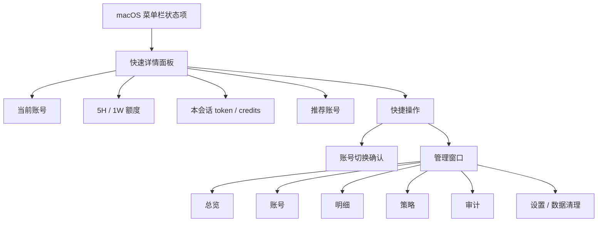
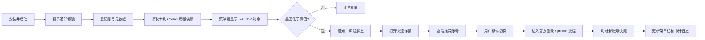
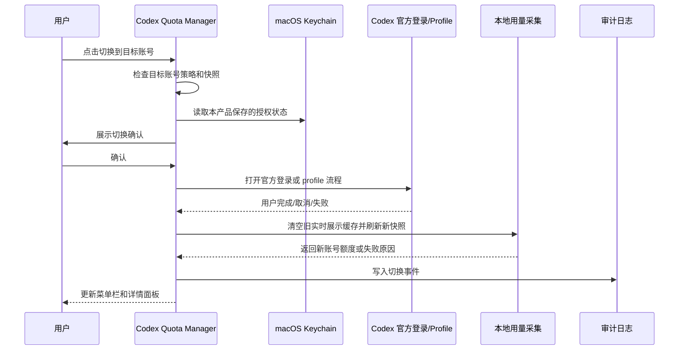
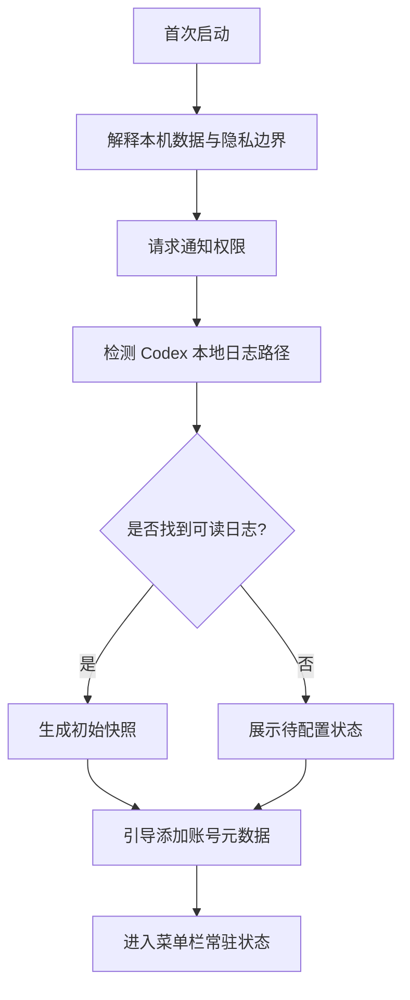

# PRD-001 Codex 多账号配额管理产品设计总览

文档编号：PRD-001  
文档状态：草案  
负责人：待定  
最后更新：2026-05-03  
关联文档：BKG-001、REQ-001、TECH-001、DEV-001、VAL-001

> 本文基于 `REQ-001-codex-multi-account-quota-management.md` 输出产品设计。本文定义用户如何使用产品、界面如何组织、关键流程如何闭环；不替代技术方案，也不承诺官方尚未开放或尚未验证的能力。

## 1. 产品定义

Codex Quota Manager 是一个 macOS 菜单栏常驻工具，面向 Codex 重度使用者和企业 IT 管理者，提供当前账号 5 小时额度、1 周额度、token 用量和 credits 估算的低打扰可视化管理。

产品定位必须保持清晰：

- 它是“配额监控、用量透明、低额度提醒、账号推荐、用户确认式切换”的治理工具。
- 它不是“后台静默轮换账号、绕过官方额度限制、池化个人账号额度”的工具。
- 所有账号都必须由用户主动授权；所有切换动作都必须可感知、可确认、可审计。

### 1.1 设计目标

| 目标 | 设计要求 |
|---|---|
| 低打扰 | 菜单栏常驻展示，不强迫用户打开管理窗口 |
| 高可见 | 5H / 1W 剩余额度必须一眼可见 |
| 可行动 | 低额度时直接给出推荐账号和切换入口 |
| 可解释 | token、credits、rate card、快照时间和数据来源都能追溯 |
| 合规安全 | 不读取、复制、导出或替换 Codex 内部敏感凭据 |
| 可分发 | 适合个人安装，也能演进到企业 MDM 管理 |

### 1.2 MVP 成功标准

第一版必须完成一个本机闭环：

1. 菜单栏显示当前账号 5H / 1W 剩余额度。
2. 点击后能看到当前账号、额度详情、本会话 token M、credits 估算和推荐账号。
3. 5H 剩余低于 15% 时通知；1W 剩余低于 5% 时强提醒。
4. 支持多账号登记和用户确认式切换入口。
5. 切换完成后强制刷新并展示新账号额度；刷新失败时标注数据过期。
6. OAuth / token 等敏感信息只进入 macOS Keychain。
7. 明细按账号、日期、模型、线程筛选，并支持 CSV / JSON 导出。

## 2. 用户与使用场景

### 2.1 用户角色

| 用户角色 | 主要诉求 | 关键界面 |
|---|---|---|
| Codex 重度个人用户 | 避免长任务中途撞额度，快速知道何时切换账号 | 菜单栏、快速详情面板 |
| 企业 IT 管理者 | 管理多个账号或 workspace 的用量、预算和合规边界 | 管理窗口、策略、审计 |
| 开发负责人 | 查看项目、模型、线程维度的消耗趋势 | 明细页、导出 |
| 被分发使用者 | 安装后少配置、能看懂、能按提示完成切换 | 首次引导、告警、切换确认 |

### 2.2 核心任务

| 任务 | 用户问题 | 产品回应 |
|---|---|---|
| 常驻查看 | 当前账号还能不能继续跑 Codex？ | 菜单栏显示 `Cdx 5H 55% 1W 82%` |
| 低额度提醒 | 我会不会在长任务中断？ | 阈值通知、风险颜色、推荐账号 |
| 查看明细 | 这次任务大概用了多少 token / credits？ | 快速详情面板和明细页展示 `M tokens` 与估算 credits |
| 切换账号 | 哪个账号更适合接下来继续用？ | 推荐账号、切换前检查、用户确认式切换 |
| 合规追溯 | 谁在什么时候切换、导出、改策略？ | 本地审计日志 |

## 3. 产品原则与边界

### 3.1 产品原则

| 原则 | 说明 |
|---|---|
| 剩余额度优先 | 所有核心展示统一表达“剩余比例”，避免用户把已用比例误解为可用比例 |
| 本机优先 | MVP 默认只处理本机数据，不上传聊天内容、代码内容或私有仓库内容 |
| 用户确认 | 切换账号、导出明细、清除凭据都必须由用户明确触发 |
| 失败可解释 | 采集失败不能显示为 `0%`，必须保留上次快照并说明数据可能过期 |
| 最小敏感面 | 不读取 `~/.codex/auth.json` 等敏感凭据内容，不复制 OAuth token |
| 渐进增强 | 官方 profile switching API 未确认前，不承诺无感自动切换 |

### 3.2 明确不做

- 不做后台静默自动轮换账号。
- 不做多个个人账号之间的额度池化或共享。
- 不导出 OAuth token、refresh token、cookie、`auth.json`。
- 不采集聊天正文、代码正文、仓库文件内容。
- 不承诺跨设备完整用量，除非进入 P1 / P2 并接入企业内网汇总或官方接口。
- 不把未知额度展示为 `0%`，避免制造误判。

## 4. 信息架构



信息层级按使用频率组织：

| 层级 | 展示内容 | 交互强度 |
|---|---|---|
| 菜单栏 | 当前账号 5H / 1W 剩余额度、风险状态 | 极低 |
| 快速详情面板 | 当前账号、额度、token、credits、推荐账号、刷新、切换 | 中 |
| 管理窗口 | 多账号、明细、策略、审计、导出、清理 | 高 |
| 系统通知 | 低额度、强提醒、切换结果、采集失败 | 被动提醒 |

## 5. 端到端用户旅程



设计重点是两个闭环：

- 监控闭环：采集 -> 计算 -> 展示 -> 告警 -> 去重 -> 继续采集。
- 切换闭环：推荐 -> 确认 -> 官方流程 -> 刷新 -> 审计 -> 展示新账号。

## 6. 菜单栏状态设计

### 6.1 展示格式

菜单栏状态项采用可变宽度 `NSStatusItem`。默认表达剩余额度，而不是已用额度。

| 场景 | 文案 |
|---|---|
| 默认 | `Cdx 5H 55% 1W 82%` |
| 紧凑 | `Cdx 55/82` |
| 5H 风险 | `Cdx 5H 14% 1W 64%` |
| 1W 风险 | `Cdx 5H 54% 1W 4%` |
| 刷新中 | `Cdx 刷新中...` |
| 数据过期 | `Cdx 55/82 !` |
| 未配置账号 | `Cdx 未设置` |
| 未知额度 | `Cdx 5H -- 1W --` |

### 6.2 视觉状态

| 状态 | 条件 | 菜单栏表现 | 点击后重点 |
|---|---|---|---|
| 正常 | 5H > 30% 且 1W > 30% | 默认色 | 展示最近快照 |
| 注意 | 5H 15%-30% 或 1W 5%-30% | 黄色圆点或黄色文字 | 展示趋势和预计重置 |
| 5H 风险 | 5H <= 15% 且 1W > 5% | 橙色或红色 | 推荐 5H 更充足账号 |
| 周额度临界 | 1W <= 5% | 红色 | 推荐 1W 更充足账号 |
| 执行风险 | 5H <= 5% 或 1W <= 2% | 红色高亮 | 启动长任务前要求确认 |
| 采集失败 | 最近刷新失败 | 保留上次快照 + `!` | 说明失败原因 |
| 数据过期 | 快照超过 15 分钟 | 保留上次快照 + `!` | 标注采集时间 |

### 6.3 Tooltip

菜单栏 tooltip 用于补充不适合常驻展示的信息：

```text
Codex Quota Manager
账号：主账号 / Business-A
5H 剩余：55%，预计 02:13 后重置
1W 剩余：82%，预计周三 10:00 重置
快照：2026-05-03 14:22
```

## 7. 快速详情面板

快速详情面板是高频操作中心。它必须比管理窗口轻，但比系统菜单更有信息密度。

### 7.1 面板结构

```text
┌────────────────────────────────────┐
│ Codex Quota Manager        刷新 ↻  │
├────────────────────────────────────┤
│ 当前账号：主账号 / Business-A       │
│ user***@company.com    Codex seat  │
├────────────────────────────────────┤
│ 5 小时额度   剩余 55%   已用 45%    │
│ ███████████░░░░░░░░  重置 02:13 后 │
│ 1 周额度     剩余 82%   已用 18%    │
│ ████████████████░░░  重置 周三 10:00│
├────────────────────────────────────┤
│ 本会话 token                        │
│ In 12.400M  Cached 8.250M          │
│ Out 1.120M  Reasoning 0.430M       │
│ 估算 credits 1,881.25              │
├────────────────────────────────────┤
│ 推荐：备用账号-1  5H 96%  1W 91%   │
│ [切换到推荐账号] [打开管理窗口]      │
└────────────────────────────────────┘
```

### 7.2 面板字段

| 区块 | 字段 | 说明 |
|---|---|---|
| 当前账号 | 别名、workspace、邮箱掩码、seat 类型 | 邮箱和 workspace 支持脱敏 |
| 5H / 1W | 剩余、已用、预计重置、采集时间 | 剩余比例是主视觉 |
| 本会话用量 | input、cached input、output、reasoning output | 单位统一为 `M tokens` |
| credits | 当前会话估算 credits、rate card 版本 | 说明“估算”而非官方账单 |
| 推荐账号 | 别名、5H、1W、推荐原因 | 只推荐 enabled 且授权可用账号 |
| 快捷操作 | 切换、刷新、管理窗口、导出今日明细、偏好设置、退出 | 高风险动作二次确认 |

### 7.3 快速菜单项

```text
Codex Quota Manager
当前账号：主账号 / Business-A

5 小时额度   剩余 55%   已用 45%
1 周额度     剩余 82%   已用 18%
预计重置     5H: 02:13 后 / 1W: 周三 10:00

本会话 tokens  In 12.400M / Cached 8.250M / Out 1.120M
估算 credits   1,881.25

推荐切换：备用账号-1（5H 96%, 1W 91%）

账号列表
✓ 主账号       5H 55%   1W 82%
  备用账号-1   5H 96%   1W 91%
  备用账号-2   5H 24%   1W 70%

切换到推荐账号
刷新
打开管理窗口
导出今日明细
偏好设置
退出
```

## 8. 告警与通知设计

### 8.1 触发规则

| 条件 | 告警级别 | 动作 |
|---|---|---|
| 5H 15%-30% 或 1W 5%-30% | 注意 | 菜单栏变黄，不默认发通知 |
| 5H <= 15% 且 1W > 5% | 风险 | 发送 macOS 通知，推荐可用账号 |
| 1W <= 5% | 强提醒 | 发送强提醒，推荐周额度更充足账号 |
| 5H <= 5% 或 1W <= 2% | 执行风险 | 打开长任务前提示确认 |
| 采集失败连续 3 次 | 数据风险 | 通知用户数据可能过期 |

### 8.2 通知去重

- 去重键：`account_id + window_type + threshold_level`。
- 同一账号、同一额度窗口、同一阈值等级，30 分钟内只通知一次。
- 用户手动刷新或完成切换后重新计算阈值，但不重复发送同等级通知。
- 从风险区间恢复到安全区间后，再次跌破阈值允许重新通知。

### 8.3 通知文案

| 场景 | 标题 | 内容 | 操作 |
|---|---|---|---|
| 5H <= 15% | Codex 5 小时额度偏低 | 当前账号 5H 剩余 14%，推荐切换到备用账号-1（5H 96%）。 | 查看详情、稍后提醒 |
| 1W <= 5% | Codex 周额度临界 | 当前账号 1W 剩余 4%，继续长任务可能中断。 | 查看推荐账号、忽略本次 |
| 采集失败 | Codex 配额刷新失败 | 已保留上次快照，当前数据可能过期。 | 重试、打开诊断 |
| 切换成功 | Codex 账号已切换 | 已切换到备用账号-1，并刷新新账号额度。 | 查看详情 |
| 切换失败 | Codex 账号切换未完成 | 官方登录流程未确认，当前账号未变化。 | 重新切换、查看审计 |

## 9. 账号推荐与切换设计

### 9.1 推荐策略

推荐账号必须保守，避免频繁切换和不合规使用。

| 因子 | 说明 |
|---|---|
| 5H 剩余 | 5H 风险时权重最高 |
| 1W 剩余 | 周额度风险时权重最高 |
| 账号启用状态 | disabled 账号不参与推荐 |
| 授权状态 | expired / revoked 账号不参与直接推荐 |
| 优先级 | 用户或企业策略指定的优先级 |
| 最近切换时间 | 避免短时间内来回切换 |
| workspace / 用途 | 可限制某些账号只用于特定业务 |

建议评分模型：

```text
score =
  five_hour_remaining_percent * w_5h
  + weekly_remaining_percent * w_1w
  + priority_score
  - recent_switch_penalty
  - policy_penalty
```

当触发 5H 风险时提高 `w_5h`；当触发 1W 风险时提高 `w_1w`。

### 9.2 切换前检查

用户点击“切换到账号 B”后，产品先做检查：

1. 账号 B 是否启用。
2. 账号 B 授权状态是否 active。
3. 账号 B 最近快照是否存在且未过期。
4. 账号 B 的 5H / 1W 剩余是否满足策略阈值。
5. 当前是否存在正在进行的切换流程。
6. 是否需要用户重新登录或打开官方账号选择流程。

### 9.3 切换确认弹窗

```text
切换 Codex 账号？

当前账号：主账号 / Business-A
目标账号：备用账号-1 / Business-B

目标账号当前额度：
5H 剩余 96%，1W 剩余 91%

系统将进入官方登录或 profile 切换流程。Codex Quota Manager 不会复制或替换 OAuth token。

[取消] [继续切换]
```

### 9.4 切换流程



### 9.5 切换后状态

| 状态 | 菜单栏 | 面板说明 |
|---|---|---|
| 切换中 | `Cdx 刷新中...` | 禁用重复切换，展示目标账号 |
| 成功 | 新账号 5H / 1W | 展示新快照和采集时间 |
| 用户取消 | 保留原账号 | 写入 cancelled 审计记录 |
| 官方流程失败 | 保留原账号 + 错误提示 | 提示重新登录或查看诊断 |
| 刷新失败 | 保留新账号标识 + `!` | 标注“数据可能过期”，不显示为 0% |

## 10. 管理窗口设计

管理窗口采用 macOS 原生 SwiftUI / AppKit 风格，目标是信息密度高、清晰、可长期使用。建议左侧页签或顶部 segmented control，包含 5 个核心页签。

### 10.1 总览页

目标：一屏看到所有账号的健康状态和本日消耗。

| 模块 | 内容 |
|---|---|
| 账号健康表 | 别名、workspace、5H 剩余、1W 剩余、今日 credits、状态 |
| 风险账号 | 低于阈值、授权过期、快照过期的账号 |
| 用量概览 | 今日 token M、今日 credits、本周 credits 估算 |
| 推荐操作 | 刷新全部、切换到推荐账号、导出今日明细 |

低保真结构：

```text
┌────────────────────────────────────────────────────────────┐
│ 总览                                  刷新全部  导出今日明细 │
├────────────────────────────────────────────────────────────┤
│ 账号健康                                                     │
│ 主账号       5H 55%  1W 82%  今日 1,881 credits  正常        │
│ 备用账号-1   5H 96%  1W 91%  今日 230 credits    推荐        │
│ 备用账号-2   5H 24%  1W 70%  今日 640 credits    注意        │
├────────────────────────────────────────────────────────────┤
│ 风险与建议                                                   │
│ 当前无周额度临界账号。备用账号-1 可作为下一次切换目标。        │
└────────────────────────────────────────────────────────────┘
```

### 10.2 账号页

目标：维护多账号元数据和授权状态。

| 字段 | 说明 |
|---|---|
| 别名 | 用户可编辑 |
| workspace | 可脱敏展示 |
| 邮箱掩码 | 默认不显示完整邮箱 |
| plan / seat | Plus / Business / Codex seat / unknown |
| 授权状态 | active / expired / revoked / unknown |
| 优先级 | 用于推荐策略 |
| 启用状态 | 是否参与推荐 |
| 最近切换 | 用于避免频繁切换 |

操作：

- 添加账号。
- 重新授权。
- 禁用账号。
- 设置用途标签。
- 清除本产品保存的账号元数据和 Keychain 凭据。

### 10.3 明细页

目标：解释 token 和 credits 是如何产生的。

筛选项：

- 时间范围：今天、近 7 天、本月、自定义。
- 账号。
- workspace。
- 模型。
- 线程 / 任务。
- 数据来源：local_jsonl、official_api、imported_report。

表格字段：

| 字段 | 单位 / 说明 |
|---|---|
| 时间 | 本地时间 |
| 账号 | 别名 |
| 线程 | 标题或脱敏 ID |
| 模型 | 模型名称 |
| input | `M tokens` |
| cached input | `M tokens` |
| output | `M tokens` |
| reasoning output | `M tokens`，如可获得 |
| estimated credits | 按 rate card 估算 |
| rate card version | 费率版本 |
| source | 数据来源 |

导出前确认文案：

```text
导出用量明细？

导出的 CSV / JSON 将包含账号别名、workspace、线程标识、模型、token M 和 credits 估算。
不会包含 OAuth token、聊天内容、代码内容或凭据文件。

[取消] [导出]
```

### 10.4 策略页

目标：配置阈值、通知、推荐规则和低额度行为。

| 配置 | 默认值 |
|---|---|
| 5H 风险阈值 | 15% |
| 1W 强提醒阈值 | 5% |
| 注意阈值 | 5H 30%，1W 30% |
| 执行风险阈值 | 5H 5%，1W 2% |
| 通知去重窗口 | 30 分钟 |
| 快照过期时间 | 15 分钟 |
| 推荐策略 | 优先剩余额度，其次账号优先级 |
| 低额度行为 | 通知 + 推荐账号，不自动切换 |

企业分发时，可将部分策略设为只读。

### 10.5 审计页

目标：记录影响安全、合规和解释性的动作。

审计事件：

- 登录 / 重新授权。
- 配额刷新。
- 账号切换：from / to / reason / result。
- 明细导出。
- 策略变更。
- 数据清理。
- 采集失败。

字段：

| 字段 | 说明 |
|---|---|
| 时间 | 本地时间 |
| 事件类型 | login / refresh / switch / export / policy_change / cleanup |
| 操作者 | 本机用户或系统 |
| 对象 | 账号、策略、导出文件 |
| 结果 | success / failed / cancelled |
| 备注 | 错误原因或上下文 |

## 11. 首次启动与权限设计

### 11.1 首次启动流程



### 11.2 权限说明

| 权限 / 数据 | 用途 | 展示方式 |
|---|---|---|
| 通知权限 | 低额度提醒和切换结果 | 首次启动请求，可在设置中关闭 |
| 本地 Codex 日志只读访问 | 计算 token 与额度快照 | 明确说明不读取代码正文 |
| Keychain | 保存本产品授权凭据 | 不允许导出明文 |
| 文件导出位置 | 导出 CSV / JSON | 每次导出由用户选择 |

## 12. 状态、空态与错误处理

| 场景 | UI 状态 | 行为 |
|---|---|---|
| 未添加账号 | `Cdx 未设置` | 点击进入账号添加引导 |
| 未找到 Codex 日志 | 显示待配置 | 提示确认 Codex 是否已使用或路径是否变化 |
| 快照为空 | `5H -- 1W --` | 不触发低额度通知 |
| 日志字段缺失 | 降级展示 token 或额度 | 标记数据来源和缺失字段 |
| 采集失败 | 保留上次快照 + `!` | 提供重试和诊断入口 |
| 授权过期 | 账号页显示 expired | 不参与推荐，提示重新授权 |
| 切换取消 | 回到原账号状态 | 记录 cancelled |
| 切换完成但刷新失败 | 显示新账号 + 数据过期 | 不把额度显示为 0% |
| rate card 缺失 | credits 显示 `--` | token 仍正常展示，提示配置费率 |

## 13. 数据展示规则

### 13.1 额度

- 菜单栏只展示 5H / 1W 剩余比例。
- 快速详情展示剩余、已用、预计重置、快照时间。
- 管理窗口展示账号维度和时间维度的趋势。
- 1W 额度无法稳定获得时显示 `--`，并标注“需验证数据源”。

### 13.2 token

所有 token 展示单位统一为 `M tokens`：

```text
input_m_tokens = input_tokens / 1_000_000
cached_input_m_tokens = cached_input_tokens / 1_000_000
output_m_tokens = output_tokens / 1_000_000
reasoning_output_m_tokens = reasoning_output_tokens / 1_000_000
```

展示精度：

| 数值范围 | 精度 |
|---|---|
| < 0.001M | 显示 `<0.001M` |
| 0.001M - 9.999M | 3 位小数 |
| 10M - 99.99M | 2 位小数 |
| >= 100M | 1 位小数 |

### 13.3 credits

credits 使用模型级 rate card 估算：

```text
estimated_credits =
  input_m_tokens * input_credits_per_m
  + cached_input_m_tokens * cached_input_credits_per_m
  + output_m_tokens * output_credits_per_m
```

展示要求：

- 必须出现“估算”口径，不写成官方账单。
- 必须记录 rate card 版本和来源 URL。
- 历史报表按当时 rate card 版本计算，不因新费率覆盖历史解释。
- reasoning output 是否计入 output bucket，以技术验证和官方口径为准；PRD 仅要求保留字段。

## 14. 合规与安全设计

| 风险 | 产品设计 |
|---|---|
| 多账号被理解为绕过限制 | 文案明确为授权账号治理；切换必须用户确认；审计可追溯 |
| 凭据泄露 | Keychain 存储；不明文落盘；不导出敏感凭据 |
| 误采集代码或聊天内容 | MVP 只读 token / rate limit / usage 事件；不展示正文 |
| 采集数据误导 | 快照时间、数据来源、失败原因可见 |
| 频繁切换账号 | 推荐策略加入最近切换惩罚；策略页可限制切换冷却时间 |
| 企业分发风险 | 支持只读策略、脱敏展示、导出确认和审计 |

## 15. 验收标准映射

| REQ 验收 | PRD 对应设计 |
|---|---|
| A1 安装后菜单栏出现状态项 | 第 6 章菜单栏状态设计 |
| A2 token_count 更新后 10 秒内刷新 | 第 5 章监控闭环、第 12 章状态处理 |
| A3 显示 5H / 1W 剩余比例 | 第 6 章、第 13.1 节 |
| A4 5H <= 15% 通知并推荐账号 | 第 8 章、第 9 章 |
| A5 点击菜单栏看账号、额度、推荐 | 第 7 章 |
| A6 点击账号进入可审计切换流程 | 第 9 章、第 10.5 节 |
| A7 OAuth / token 不明文落盘 | 第 11.2 节、第 14 章 |
| A8 明细按账号、日期、模型、线程筛选 | 第 10.3 节 |
| A9 CSV / JSON 导出 | 第 10.3 节 |
| A10 清除数据后凭据和缓存可清理 | 第 10.2 节、第 10.5 节 |
| A11 1W <= 5% 强提醒 | 第 8 章 |
| A12 切换后展示新账号额度，失败标注过期 | 第 9.5 节、第 12 章 |
| A13 credits 使用模型级 rate card 并记录版本 | 第 13.3 节 |

## 16. 版本规划

| 阶段 | 产品范围 |
|---|---|
| P0 / MVP | 菜单栏、快速详情、本地采集、阈值通知、多账号登记、用户确认式切换、基础管理窗口、审计、导出 |
| P1 | Business usage 接入、人工导入报表、多设备摘要汇总、预算预测、MDM 配置 |
| P2 | 中央管理后台、SSO、组织级策略、合规报表、异常检测、审批流 |

## 17. 待验证问题

这些问题不阻塞 PRD 设计，但会影响技术实现和交互降级策略：

| 编号 | 问题 | 产品降级 |
|---|---|---|
| Q1 | Codex 是否提供官方 profile switching API | 没有则走官方登录流程辅助 |
| Q2 | `rate_limits.primary/secondary` 是否稳定对应 5H / 1W | 不稳定则标注来源，并允许 1W 显示未知 |
| Q3 | CLI `/status` 是否可稳定机读 | 不可机读则优先本地 JSONL + 用户手动刷新 |
| Q4 | Business usage 是否有可合规 API | 无 API 时进入 P1 人工导入 |
| Q5 | 切换后如何可靠识别新账号 | 依赖官方状态、账号标识、切换时间和后续日志归属综合判断 |
| Q6 | reasoning output tokens 计费归属 | 保留字段，credits 是否计入 output bucket 由验证决定 |

## 18. 设计结论

PRD-001 的产品重心是先把“看得见、提醒到、切得明白、追得回来”做扎实。MVP 不追求自动化程度最高的账号切换，而是优先完成可信的本机配额监控、低额度提醒、账号推荐、用户确认式切换和审计闭环。

后续如果官方确认稳定 profile switching API，可以在不改变产品边界的前提下，把“用户确认式切换”升级为更顺滑的官方 profile 切换体验；如果官方能力不足，则保持登录流程辅助和清晰的失败提示。
