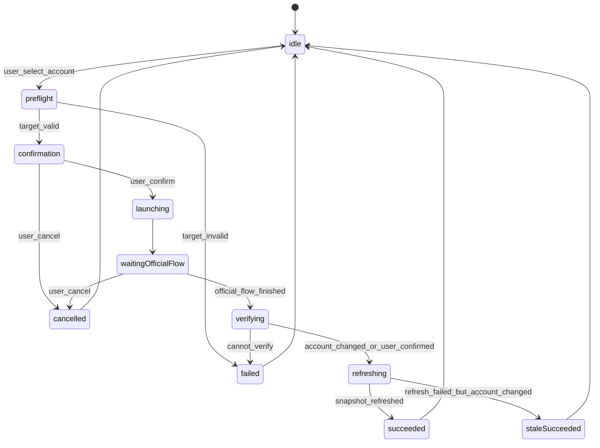

# TECH-001 Codex Quota Manager 技术方案与实现选项

文档编号：TECH-001  
文档状态：草案  
负责人：待定  
最后更新：2026-05-03  
关联文档：REQ-001、PRD-001、DEV-001、VAL-001、VAL-002

> 本文基于 `PRD-001-product-design-overview.md` 输出技术方案。设计目标是先完成一个可以安装在个人 macOS 上的本机应用，同时保持 GitHub 开源、社区使用和未来企业分发的通用性。本文不承诺官方尚未确认的 Codex profile switching API，也不设计任何后台静默轮换或凭据替换能力。

## 1. 技术结论

MVP 推荐采用原生 macOS 应用路线：

| 决策项 | 推荐方案 | 原因 |
|---|---|---|
| 客户端形态 | SwiftUI + AppKit `NSStatusItem` | 菜单栏、通知、Keychain、系统权限和打包体验最贴合 macOS |
| 架构风格 | Local-first 单机应用 + 模块化采集器 | 默认不上传数据，后续可扩展官方 API、人工导入或企业汇总 |
| 本地存储 | SQLite | 稳定、可迁移、便于明细筛选和导出，适合开源社区排查 |
| 敏感凭据 | macOS Keychain | OAuth / token 类数据不进入 SQLite、日志、导出文件 |
| 采集方式 | 只读增量解析 Codex 本地日志和状态库 | 符合 PRD 的最小敏感面，不读取聊天正文和代码内容 |
| 状态展示 | 菜单栏状态项 + SwiftUI Popover + 管理窗口 | 满足低打扰和高频查看，同时保留完整管理能力 |
| 通知 | UserNotifications | 支持低额度提醒、强提醒、切换结果和采集失败 |
| 分发 | Developer ID 签名 + Notarization + `.dmg` | 适合个人安装和 GitHub Release，不依赖 Mac App Store |
| 更新 | MVP 手动下载，P1 接入 Sparkle | 降低首版复杂度，后续支持自动更新 |

MVP 只实现“用户确认式切换入口”。切换能力采用可插拔 `SwitchProvider`，优先接入官方能力；官方能力不足时打开官方登录 / 账号选择流程并要求用户确认。禁止复制、替换、导出或上传 `~/.codex/auth.json`、OAuth token、refresh token、cookie。

## 2. 技术目标

### 2.1 P0 必须达成

- macOS 菜单栏常驻显示当前账号 5H / 1W 剩余额度。
- 本地 Codex token / rate limit 事件更新后，10 秒内刷新菜单栏和详情面板。
- 低额度通知：5H <= 15%，1W <= 5%。
- 展示本会话、今日和明细维度的 `M tokens` 与 estimated credits。
- 支持多账号元数据登记、启用 / 禁用、优先级、授权状态展示。
- 支持用户确认式切换入口、切换后刷新、失败时标注数据过期。
- 所有敏感凭据只进入 Keychain；导出文件不含凭据、聊天正文、代码正文。
- 提供 CSV / JSON 导出、本地审计日志和基础诊断。

### 2.2 通用性要求

| 要求 | 技术处理 |
|---|---|
| 可安装在任意用户自己的 Mac | 不硬编码 `/Users/fengjie`，所有路径从用户 home、系统 API 或配置读取 |
| 可放到 GitHub 给他人使用 | README、隐私说明、开源许可证、示例数据、可复现实验脚本和 CI |
| 不依赖海底捞内部环境 | 默认单机本地运行；企业配置、MDM、内网汇总全部放到 P1/P2 |
| 数据源可能变化 | 采集器适配器化，字段解析版本化，缺失字段降级为 unknown |
| 用户隐私可解释 | 本机优先、默认无遥测、导出前确认、诊断包脱敏 |
| 官方能力不稳定 | 对 profile switching、dashboard、Business usage API 均做能力检测和降级 |

## 3. 实现选项比较

| 选项 | 说明 | 优点 | 缺点 | 结论 |
|---|---|---|---|---|
| A. 原生 macOS SwiftUI + AppKit | 用 Swift 开发菜单栏应用、管理窗口和系统集成 | 体积小、Keychain / 通知 / 菜单栏体验好、适合签名公证 | 需要 macOS 原生开发能力 | 推荐作为 MVP |
| B. Tauri + Swift 辅助层 | 前端用 Web UI，系统能力由 Rust / Swift 桥接 | UI 开发快、跨平台潜力 | 菜单栏和 Keychain 仍需平台桥接，首版复杂度更高 | P1 后评估 |
| C. Electron | Web 技术快速构建桌面应用 | 社区熟悉、生态丰富 | 包体大、菜单栏常驻资源占用高、系统权限体验一般 | 不推荐 MVP |
| D. CLI + 菜单栏壳 | 先做命令行采集器，再包一层状态栏 | 验证快、便于自动化测试 | 产品体验不足，账号切换和管理窗口仍要补 | 可用于 PoC，不作为最终形态 |

MVP 可以保留一个轻量 CLI 或脚本用于验证采集字段，但正式用户体验应落在原生 macOS 应用。

## 4. 总体架构

```mermaid
flowchart LR
    subgraph Sources["本机与可选数据源"]
        A["Codex JSONL Logs"]
        B["Codex State SQLite"]
        C["Codex CLI /status"]
        D["Official Dashboard/API"]
        E["Manual Import"]
    end

    subgraph Core["本地核心层"]
        F["Collector Adapters"]
        G["Event Normalizer"]
        H["Quota Engine"]
        I["Rate Card Manager"]
        J["Account Manager"]
        K["Recommendation Engine"]
        L["Switch Coordinator"]
    end

    subgraph Storage["本机存储"]
        M["SQLite Store"]
        N["macOS Keychain"]
        O["Sanitized Logs"]
    end

    subgraph UX["用户界面与动作"]
        P["Menu Bar Status Item"]
        Q["Quick Detail Popover"]
        R["Management Window"]
        S["Notification Engine"]
        T["CSV / JSON Export"]
        U["Audit Viewer"]
    end

    A --> F
    B --> F
    C --> F
    D --> F
    E --> F
    F --> G
    G --> M
    M --> H
    I --> H
    J --> H
    H --> K
    K --> P
    H --> P
    H --> Q
    H --> R
    H --> S
    R --> T
    R --> U
    J --> N
    L --> J
    L --> S
    L --> M
    F --> O
```



### 4.1 分层说明

| 层 | 职责 |
|---|---|
| Source | 只读读取本机日志、状态库、CLI 状态和未来官方数据 |
| Collector | 监听文件变化、维护读取 offset、解析原始事件 |
| Normalizer | 把不同来源转成统一 `UsageEvent` / `QuotaSnapshot` |
| Engine | 计算剩余额度、token M、credits、阈值状态和推荐账号 |
| Storage | 保存非敏感业务数据、审计、配置、采集 offset 和脱敏日志 |
| Account | 管理账号元数据与 Keychain 凭据引用 |
| Switch | 承接用户确认式切换流程，不直接操作敏感凭据文件 |
| UX | 菜单栏、详情面板、管理窗口、通知、导出和诊断 |

## 5. 推荐代码结构

开源仓库建议按模块组织，避免把 UI、采集、计算和存储耦合在一个目录里。

```text
codex-switchboard/
  App/
    CodexQuotaManagerApp.swift
    AppDelegate.swift
    MenuBar/
    Popover/
    ManagementWindow/
    Settings/
  Sources/
    Core/
      Models/
      QuotaEngine/
      Recommendation/
      RateCard/
      Policy/
    Collectors/
      LocalJSONLCollector/
      CodexStateSQLiteCollector/
      CLIStatusCollector/
      ManualImportCollector/
    Storage/
      SQLiteStore/
      KeychainStore/
      Migrations/
    Switch/
      SwitchCoordinator/
      Providers/
    Export/
    Diagnostics/
  Tests/
    CoreTests/
    CollectorTests/
    StorageTests/
    SnapshotTests/
  Fixtures/
    codex-jsonl/
    rate-cards/
  docs/
```

如果采用 Xcode 工程，可以把 `Sources/` 做成 Swift Package，App 只负责组合和 UI。这样后续 CLI、测试工具或企业版都能复用 Core。

## 6. 数据采集方案

### 6.1 数据源优先级

| 优先级 | 数据源 | MVP 状态 | 用途 | 降级策略 |
|---|---|---|---|---|
| 1 | `~/.codex/sessions/**/*.jsonl` 或 rollout JSONL | 必做 | token_count、rate_limits、线程级明细 | 字段缺失时只展示可解析字段 |
| 2 | `~/.codex/state_*.sqlite` | 必做 | 线程索引、cwd、title、rollout_path、tokens_used | 找不到时允许用户选择日志目录 |
| 3 | Codex CLI `/status` 或等价命令 | PoC 验证后接入 | 当前账号与额度快照补强 | 不可机读时标注 unavailable |
| 4 | Codex usage dashboard / 官方 API | P1 | 账号或 workspace 级用量 | 无官方合规读取方式时不做 |
| 5 | Business usage analytics / 人工导入 | P1 | 企业 workspace 汇总 | 导入 CSV / JSON，不采集敏感正文 |

### 6.2 本地日志采集

采集器采用增量读取：

1. 首次启动扫描用户 home 下的 Codex 状态库和会话日志。
2. 为每个日志文件记录 `file_id`、`path`、`last_offset`、`last_inode`、`last_seen_at`。
3. 使用 `DispatchSourceFileSystemObject`、FSEvents 或定时兜底轮询监听新增内容。
4. 只解析 JSONL 中的结构化 usage / rate limit 字段。
5. 对解析失败的行写入脱敏诊断计数，不保存原始正文。
6. 解析结果进入 `UsageEvent` 和 `QuotaSnapshot`，原始日志不复制到应用目录。

### 6.3 字段映射

| 原始字段 | 统一字段 | 说明 |
|---|---|---|
| `last_token_usage.input_tokens` | `input_tokens_delta` | 本轮 input 增量 |
| `last_token_usage.cached_input_tokens` | `cached_input_tokens_delta` | 本轮 cached input 增量 |
| `last_token_usage.output_tokens` | `output_tokens_delta` | 本轮 output 增量 |
| `last_token_usage.reasoning_output_tokens` | `reasoning_output_tokens_delta` | 如可获得则保存 |
| `total_token_usage.*` | `thread_total_*` | 用于线程累计展示和校验 |
| `rate_limits.primary.used_percent` | `five_hour_used_percent` | 按 VAL-002 暂定映射 5H |
| `rate_limits.primary.resets_at` | `five_hour_resets_at` | 重置时间 |
| `rate_limits.secondary.used_percent` | `weekly_used_percent` | 按 VAL-002 暂定映射 1W，需要持续验证 |
| `rate_limits.secondary.resets_at` | `weekly_resets_at` | 重置时间 |
| `rate_limits.rate_limit_reached_type` | `rate_limit_reached_type` | 判断是否触顶 |

### 6.4 快照可信度

每个 `QuotaSnapshot` 保存 `confidence`，避免把不稳定字段伪装成确定值。

| 值 | 含义 | UI 表现 |
|---|---|---|
| `verified` | 与 `/status` 或 dashboard 对账通过 | 正常展示 |
| `observed` | 来自本机日志，字段完整但未对账 | 展示数据来源 |
| `partial` | token 或其中一个窗口缺失 | 缺失项显示 `--` |
| `stale` | 超过 15 分钟未刷新 | 菜单栏加 `!` |
| `failed` | 连续采集失败 | 保留上次快照并展示失败原因 |

## 7. 核心数据模型

MVP 使用 SQLite 保存非敏感数据。所有表都建议包含 `created_at`、`updated_at`，时间统一保存 UTC ISO-8601 或 epoch seconds，UI 展示时转换为本地时区。

### 7.1 `accounts`

| 字段 | 类型 | 说明 |
|---|---|---|
| `account_id` | text primary key | 本产品内部 UUID |
| `alias` | text | 用户可编辑别名 |
| `provider` | text | `openai` / `chatgpt` / `unknown` |
| `workspace_name` | text nullable | 可脱敏 |
| `email_masked` | text nullable | 默认只保存脱敏邮箱 |
| `plan_type` | text | `plus` / `business` / `enterprise` / `unknown` |
| `seat_type` | text | `standard` / `codex` / `unknown` |
| `auth_method` | text | `chatgpt` / `api_key` / `unknown` |
| `auth_status` | text | `active` / `expired` / `revoked` / `unknown` |
| `keychain_ref` | text nullable | Keychain item 标识，不保存 secret |
| `priority` | integer | 推荐权重 |
| `enabled` | integer | 是否参与推荐 |
| `last_switched_at` | datetime nullable | 最近切换时间 |

### 7.2 `usage_events`

| 字段 | 类型 | 说明 |
|---|---|---|
| `event_id` | text primary key | 事件 UUID 或内容 hash |
| `account_id` | text nullable | 无法归属时为空 |
| `thread_id` | text nullable | Codex 线程 ID |
| `task_title_masked` | text nullable | 可配置脱敏 |
| `event_time` | datetime | 事件时间 |
| `model` | text nullable | 模型名称 |
| `input_tokens_delta` | integer | input 增量 |
| `cached_input_tokens_delta` | integer | cached input 增量 |
| `output_tokens_delta` | integer | output 增量 |
| `reasoning_output_tokens_delta` | integer | reasoning output 增量 |
| `estimated_credits_delta` | real nullable | 按 rate card 估算 |
| `rate_card_version` | text nullable | 费率版本 |
| `source` | text | `local_jsonl` / `state_sqlite` / `cli_status` / `official_api` / `imported_report` |

### 7.3 `quota_snapshots`

| 字段 | 类型 | 说明 |
|---|---|---|
| `snapshot_id` | text primary key | 快照 UUID |
| `account_id` | text nullable | 当前账号 |
| `captured_at` | datetime | 采集时间 |
| `source` | text | 数据来源 |
| `confidence` | text | `verified` / `observed` / `partial` / `stale` / `failed` |
| `five_hour_used_percent` | real nullable | 已用比例 |
| `five_hour_remaining_percent` | real nullable | 剩余比例 |
| `five_hour_resets_at` | datetime nullable | 重置时间 |
| `weekly_used_percent` | real nullable | 已用比例 |
| `weekly_remaining_percent` | real nullable | 剩余比例 |
| `weekly_resets_at` | datetime nullable | 重置时间 |
| `input_tokens` | integer | 当前聚合 input |
| `cached_input_tokens` | integer | 当前聚合 cached input |
| `output_tokens` | integer | 当前聚合 output |
| `reasoning_output_tokens` | integer | 当前聚合 reasoning output |
| `estimated_credits` | real nullable | estimated credits |
| `failure_reason` | text nullable | 失败或降级原因 |

### 7.4 其他表

| 表 | 职责 |
|---|---|
| `rate_cards` | 模型费率、来源 URL、生效时间、版本 |
| `alert_events` | 阈值告警、去重键、通知结果 |
| `switch_events` | from / to / reason / result / message |
| `audit_events` | 登录、刷新、切换、导出、策略变更、清理 |
| `collector_offsets` | 文件 offset、inode、最后解析时间 |
| `app_settings` | 阈值、快照过期时间、脱敏配置、导出偏好 |
| `schema_migrations` | SQLite migration 版本 |

## 8. 配额与 credits 计算

### 8.1 剩余额度

```text
remaining_percent = max(0, min(100, 100 - used_percent))
```

处理规则：

- `primary.window_minutes = 300` 且字段稳定时映射为 5H。
- `secondary.window_minutes = 10080` 且字段稳定时映射为 1W。
- 同一个窗口内展示最高观测已用比例，避免较旧样本降低风险等级。
- 任一窗口字段缺失时显示 `--`，不触发低额度通知。
- 刷新失败时保留上次有效快照，禁止显示为 `0%`。

### 8.2 token 展示

```text
input_m_tokens = input_tokens / 1_000_000
cached_input_m_tokens = cached_input_tokens / 1_000_000
output_m_tokens = output_tokens / 1_000_000
reasoning_output_m_tokens = reasoning_output_tokens / 1_000_000
```

展示精度遵循 PRD-001 第 13.2 节。

### 8.3 credits 估算

```text
estimated_credits =
  input_m_tokens * input_credits_per_m
  + cached_input_m_tokens * cached_input_credits_per_m
  + output_m_tokens * output_credits_per_m
```

要求：

- Rate card 从内置 JSON 配置、用户导入或未来官方源读取。
- 每次计算保存 `rate_card_version` 和 `source_url`。
- 历史报表按事件发生时的 rate card 版本解释。
- reasoning output 是否计入 output bucket 由 VAL 验证结论决定，MVP 先保存字段但不擅自重复计费。

## 9. 告警与推荐

### 9.1 告警状态机

| 状态 | 条件 | 动作 |
|---|---|---|
| `normal` | 5H > 30% 且 1W > 30% | 菜单栏默认色 |
| `warning` | 5H 15%-30% 或 1W 5%-30% | 菜单栏黄色，不默认通知 |
| `five_hour_risk` | 5H <= 15% 且 1W > 5% | 通知 + 推荐账号 |
| `weekly_critical` | 1W <= 5% | 强提醒 + 推荐周额度充足账号 |
| `execution_risk` | 5H <= 5% 或 1W <= 2% | 长任务前确认 |
| `data_stale` | 快照超过 15 分钟 | 菜单栏 `!` |
| `collector_failed` | 连续失败 3 次 | 通知 + 诊断入口 |

### 9.2 通知去重

```text
dedupe_key = account_id + window_type + threshold_level
```

- 同一去重键 30 分钟内只通知一次。
- 从风险区间恢复到安全区间后，允许下次重新触发。
- 用户手动刷新或切换账号后重新计算状态，但不重复发送同等级通知。

### 9.3 推荐算法

MVP 使用可解释规则评分，不使用黑盒模型。

```text
score =
  five_hour_remaining_percent * w_5h
  + weekly_remaining_percent * w_1w
  + priority_score
  - recent_switch_penalty
  - policy_penalty
```

规则：

- 5H 风险时提高 `w_5h`。
- 1W 风险时提高 `w_1w`。
- `disabled`、`expired`、`revoked`、快照过期严重的账号不参与直接推荐。
- 最近切换过的账号加惩罚，避免频繁来回切换。
- 推荐结果必须展示推荐原因，例如“5H 96%、1W 91%、优先级高”。

## 10. 账号切换技术方案

### 10.1 设计边界

- 切换必须由用户点击并确认。
- 不做后台静默轮换。
- 不直接读取、复制、替换或导出 Codex 内部凭据文件。
- 切换结果必须写入审计日志。
- 切换完成后必须刷新新账号快照；刷新失败时标注过期。

### 10.2 `SwitchProvider` 分层

| Provider | 触发条件 | MVP 处理 |
|---|---|---|
| `OfficialProfileProvider` | 官方提供稳定 profile switching API / CLI | 预留接口，验证后接入 |
| `OfficialLoginProvider` | 可调用官方 login / logout / status 流程 | MVP 优先实现 |
| `ProfileWorkspaceProvider` | 官方支持安全指定 profile 目录 | PoC 验证后考虑 |
| `ManualInstructionProvider` | 无法机读或无法自动打开流程 | 显示步骤，引导用户手动完成 |

### 10.3 状态机



### 10.4 切换后校验

优先级：

1. 官方状态命令返回当前账号 / workspace 标识。
2. 新的 `rate_limits` / `token_count` 样本带有可归属账号信息。
3. 用户在确认弹窗中明确选择“我已完成切换”，应用刷新并标注 `observed`。
4. 无法确认时保留原账号，审计结果为 `failed` 或 `cancelled`。

## 11. UI 技术方案

### 11.1 菜单栏

- 使用 `NSStatusItem.variableLength`。
- 菜单栏标题由 `QuotaViewModel` 统一生成，避免 UI 层自行计算风险。
- 支持默认、紧凑、刷新中、数据过期、未配置、未知额度等状态。
- 状态更新来自主线程，底层采集和计算使用 actor / async task 隔离。

### 11.2 快速详情面板

- 使用 `NSPopover` 承载 SwiftUI view。
- 展示当前账号、5H / 1W、token M、estimated credits、推荐账号和快捷操作。
- 关键按钮：刷新、切换到推荐账号、打开管理窗口、导出今日明细、偏好设置、退出。
- 切换、导出、清理这类动作必须二次确认。

### 11.3 管理窗口

管理窗口使用 SwiftUI `TabView` 或侧边栏导航：

| 页签 | MVP 内容 |
|---|---|
| 总览 | 账号健康表、风险账号、今日 credits、推荐操作 |
| 账号 | 添加、编辑、禁用、授权状态、优先级、清除账号数据 |
| 明细 | 时间、账号、模型、线程、token M、credits、source |
| 策略 | 阈值、通知去重、快照过期、脱敏、推荐策略 |
| 审计 | refresh、switch、export、policy_change、cleanup |

## 12. 安全、隐私与权限

### 12.1 本地权限策略

| 能力 | MVP 方案 |
|---|---|
| 读取 Codex 日志 | 默认探测 `~/.codex`；失败时让用户选择目录 |
| 应用沙盒 | MVP 以 Developer ID 分发为主，不上 Mac App Store；如开启 sandbox，则使用 security-scoped bookmark |
| Keychain | 保存本产品自身 secret 或授权引用，不保存到 SQLite |
| 通知 | 首次启动请求，设置页可关闭 |
| 导出 | 每次由用户选择位置，导出前展示隐私说明 |

### 12.2 禁止事项

- 禁止保存明文 OAuth token、refresh token、cookie。
- 禁止复制 `~/.codex/auth.json` 到应用目录。
- 禁止上传聊天正文、代码正文、私有仓库内容。
- 禁止把诊断日志做成包含原始 JSONL 全量内容的压缩包。
- 禁止以 `0%` 表示未知额度。

### 12.3 诊断包

诊断包只允许包含：

- 应用版本、macOS 版本、采集器版本。
- 配置摘要和阈值。
- 数据源是否可读、文件数量、最后 offset。
- 解析成功 / 失败计数。
- 最近快照的脱敏字段。
- 最近错误栈的脱敏摘要。

## 13. 分发、开源与部署

### 13.1 个人安装

| 项目 | 方案 |
|---|---|
| 构建产物 | `.app` + `.dmg` |
| 签名 | Apple Developer ID Application |
| 公证 | Apple Notarization |
| 最低系统 | 建议 macOS 14+，具体由 SwiftUI / Xcode 支持矩阵决定 |
| 数据目录 | `~/Library/Application Support/Codex Quota Manager` |
| 日志目录 | `~/Library/Logs/Codex Quota Manager` |
| 数据库 | `Application Support/.../quota-manager.sqlite` |

### 13.2 GitHub 开源准备

仓库需要包含：

- `README.md`：产品定位、安装方式、隐私边界、截图。
- `SECURITY.md`：漏洞报告方式和敏感数据处理说明。
- `PRIVACY.md`：默认本机运行、无遥测、导出范围。
- `CONTRIBUTING.md`：开发环境、测试、提交规范。
- `LICENSE`：建议先确定开源协议，默认可选 MIT / Apache-2.0。
- `Fixtures/`：脱敏 JSONL 样例和 rate card 样例。
- GitHub Actions：build、test、lint。
- Release checklist：签名、公证、校验和、版本说明。

### 13.3 企业分发预留

P1/P2 再实现：

- MDM 配置文件导入。
- 只读策略。
- 企业统一 rate card。
- 多设备摘要汇总。
- 组织级审计导出。

MVP 不引入企业后台，避免影响个人用户安装和开源可用性。

## 14. 配置与扩展点

| 扩展点 | 接口建议 | 说明 |
|---|---|---|
| Collector | `CollectorAdapter` | 新增官方 API、Dashboard、导入源时复用 |
| Switch | `SwitchProvider` | 官方 profile API 出现后替换 provider |
| Rate card | `RateCardProvider` | 内置 JSON、用户导入、远程配置 |
| Export | `ExportFormatter` | CSV、JSON，后续可加 Parquet |
| Policy | `PolicyProvider` | 本地设置，后续可接 MDM 只读策略 |
| Redaction | `RedactionPolicy` | 邮箱、workspace、线程标题脱敏 |

## 15. 测试方案

| 测试类型 | 范围 |
|---|---|
| 单元测试 | token M 计算、credits、阈值、推荐、通知去重 |
| 解析器测试 | JSONL fixture、字段缺失、无效 JSON、日志轮转 |
| 存储测试 | SQLite migration、索引、查询筛选、导出 |
| 集成测试 | 从 fixture 生成快照并刷新菜单栏 view model |
| UI smoke | 菜单栏标题、popover 状态、管理窗口页签 |
| 安全测试 | 导出文件不含 token / cookie / auth 字段，诊断包脱敏 |
| 手工验收 | 对照 REQ A1-A13 执行 |

## 16. 关键风险与缓解

| 风险 | 影响 | 缓解 |
|---|---|---|
| Codex 本地日志格式变化 | token / quota 采集失效 | 解析器版本化、fixture 回归、缺失字段降级 |
| 1W 字段不稳定 | 周额度提醒不准 | 持续按 VAL-001 对账，不稳定时显示 `--` |
| 官方无 profile switching API | 无法顺滑切换 | 使用官方登录流程辅助和手动确认 |
| Keychain / sandbox 权限差异 | 安装后读取失败 | 首次启动检测、用户选择目录、诊断入口 |
| rate card 变化 | credits 估算偏差 | 配置化、版本化、来源 URL、历史保留 |
| 开源用户环境差异 | issue 难复现 | 诊断包脱敏、fixture、清晰的环境信息 |
| 多账号合规误解 | 产品风险 | 文案、审计、用户确认、禁止后台静默切换 |

## 17. MVP 技术验收映射

| REQ 验收 | 技术实现 |
|---|---|
| A1 菜单栏状态项 | `NSStatusItem` + AppDelegate |
| A2 10 秒内刷新 | 文件监听 + 增量 offset + `QuotaViewModel` 推送 |
| A3 5H / 1W 剩余 | `QuotaEngine` 从 snapshot 计算 remaining |
| A4 5H <= 15% 通知 | `NotificationEngine` + 去重表 |
| A5 点击查看账号和推荐 | `NSPopover` 快速详情 |
| A6 可审计切换流程 | `SwitchCoordinator` + `switch_events` + `audit_events` |
| A7 凭据不明文落盘 | Keychain + SQLite 仅保存 `keychain_ref` |
| A8 明细筛选 | `usage_events` 查询和管理窗口明细页 |
| A9 CSV / JSON 导出 | `ExportFormatter` + 导出确认 |
| A10 清除数据 | Settings cleanup + Keychain 删除 + SQLite 清理 |
| A11 1W <= 5% 强提醒 | weekly threshold policy |
| A12 切换后刷新 | switch state machine 的 `refreshing` 阶段 |
| A13 rate card 版本 | `rate_cards` 表 + event 记录 `rate_card_version` |

## 18. 后续技术文档拆分规则

TECH-001 只承载首版总体架构。后续迭代按主题新增文档，不在本文无限追加：

| 文档 | 触发条件 |
|---|---|
| `TECH-002-official-profile-switching.md` | 官方 profile switching 能力被验证 |
| `TECH-003-business-usage-integration.md` | 接入 Business usage / dashboard / official API |
| `TECH-004-enterprise-mdm-and-policy.md` | 进入 MDM、只读策略和企业分发 |
| `ADR-001-storage-choice.md` | 需要固化 SQLite / SwiftData / CoreData 决策 |
| `ADR-002-distribution-channel.md` | 需要固化 GitHub Release、Sparkle、Mac App Store 取舍 |
