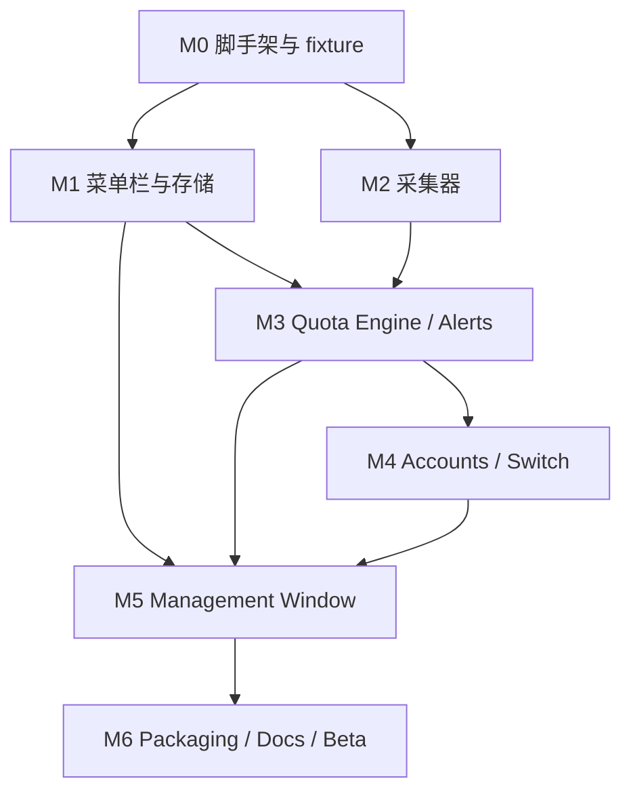

# DEV-001 Codex Quota Manager MVP 开发任务拆解

文档编号：DEV-001  
文档状态：草案  
负责人：待定  
最后更新：2026-05-03  
关联文档：REQ-001、PRD-001、TECH-001、VAL-001、VAL-002

> 本文定义 MVP 的开发拆解和交付顺序。后续 P1 / P2 或官方能力验证后的迭代，不继续塞进本文，按 `DEV-002-*`、`TECH-002-*` 或 `ADR-*` 新增文档。

## 1. MVP 目标

交付一个可在个人 macOS 安装和本机验证的 Codex Quota Manager Beta：

- 菜单栏显示当前账号 5H / 1W 剩余额度。
- 点击菜单栏可查看当前账号、额度详情、本会话 token M、estimated credits 和推荐账号。
- 本地 Codex token / rate limit 事件更新后，10 秒内刷新。
- 5H <= 15% 发送通知；1W <= 5% 发送强提醒。
- 支持多账号元数据登记、启用 / 禁用、优先级和授权状态。
- 支持用户确认式账号切换入口，切换后刷新新账号快照。
- 支持明细筛选、CSV / JSON 导出、本地审计和数据清理。
- 敏感凭据只进入 Keychain，导出和诊断不包含 token、cookie、聊天正文、代码正文。
- 仓库具备 GitHub 开源使用的基础文档、示例数据和测试。

## 2. 交付范围

### 2.1 包含

| 范围 | 内容 |
|---|---|
| macOS App | 菜单栏状态项、快速详情面板、管理窗口、设置 |
| Core | quota、token M、credits、告警、推荐、策略 |
| Collector | 本地 JSONL 和 Codex state SQLite 采集 |
| Storage | SQLite、Keychain 引用、migration、导出 |
| Switch | 用户确认式官方登录 / 切换流程入口和审计 |
| Security | Keychain、脱敏、导出确认、诊断包 |
| Release | 本地构建、GitHub README、隐私说明、测试 fixture |

### 2.2 不包含

- 后台静默自动轮换账号。
- 复制、替换或同步 Codex 内部凭据文件。
- 中央管理后台、SSO、审批流。
- Business usage 官方 API 或 Dashboard 自动采集，除非 VAL 验证已明确可合规接入。
- 多设备汇总。
- Mac App Store 上架。

## 3. 建议里程碑

按 1 名主要开发者估算，MVP 建议拆为 7 个里程碑。周期是工程估算，不是承诺排期。

| 里程碑 | 建议周期 | 目标 | 可验收输出 |
|---|---|---|---|
| M0 验证与脚手架 | 2-3 天 | 固化仓库结构、fixture、基础构建 | Swift app 可启动，测试框架可运行 |
| M1 菜单栏与本地存储 | 3-5 天 | 菜单栏状态、Popover、SQLite migration | `Cdx 未设置` / mock quota 可展示 |
| M2 本地采集与配额引擎 | 5-7 天 | 解析 JSONL / state SQLite，生成快照 | fixture 可生成 5H / 1W / token M |
| M3 credits、告警与推荐 | 4-6 天 | rate card、通知、去重、推荐账号 | 低额度 fixture 触发通知和推荐 |
| M4 多账号与切换闭环 | 5-7 天 | 账号元数据、Keychain 引用、切换状态机 | 用户确认式切换流程可审计 |
| M5 管理窗口、导出和清理 | 5-8 天 | 总览、账号、明细、策略、审计、导出 | CSV / JSON 导出且不含敏感字段 |
| M6 打包、文档和 Beta 验收 | 3-5 天 | 签名准备、README、隐私说明、验收回归 | 可发布 GitHub Beta 包 |

## 4. 依赖关系

## 5. 任务拆解

### 5.1 M0 验证与工程脚手架

| 编号 | 任务 | 输出 | 验收 |
|---|---|---|---|
| T-001 | 创建 macOS App 工程和 Swift Package 模块 | `App/`、`Sources/`、`Tests/` | 本地能启动空菜单栏 App |
| T-002 | 建立测试 fixture 目录 | 脱敏 JSONL、rate card 样例 | 测试可读取 fixture |
| T-003 | 建立基础 CI | GitHub Actions build/test | PR 或 push 可跑测试 |
| T-004 | 定义核心模型 | Account、UsageEvent、QuotaSnapshot、RateCard | CoreTests 可编译 |
| T-005 | 编写开发 README | 本地构建、测试、调试说明 | 新用户能按文档启动工程 |

### 5.2 M1 菜单栏与本地存储

| 编号 | 任务 | 输出 | 验收 |
|---|---|---|---|
| T-101 | 实现 `NSStatusItem` | 菜单栏常驻状态 | 未配置时显示 `Cdx 未设置` |
| T-102 | 实现快速详情 Popover 骨架 | 当前账号、额度、按钮区域 | mock 数据可展示 |
| T-103 | 实现 SQLiteStore 和 migration | accounts、snapshots、events 基础表 | migration 测试通过 |
| T-104 | 实现 AppSettings | 阈值、快照过期时间、脱敏配置 | 设置可持久化 |
| T-105 | 实现 mock `QuotaViewModel` | UI 与 Core 解耦 | 切换 mock 状态不崩溃 |

### 5.3 M2 本地采集与配额引擎

| 编号 | 任务 | 输出 | 验收 |
|---|---|---|---|
| T-201 | 实现 Codex state SQLite 读取 | 线程、cwd、rollout_path | 能列出当前项目线程 |
| T-202 | 实现 JSONL 增量解析器 | token_count / rate_limits 事件 | fixture 单测覆盖字段缺失 |
| T-203 | 实现 collector offset | 文件 offset、inode、最后读取时间 | 重启后不重复导入 |
| T-204 | 实现 `EventNormalizer` | UsageEvent、QuotaSnapshot | 样例事件可入库 |
| T-205 | 实现 `QuotaEngine` | 5H / 1W remaining、stale 状态 | VAL-002 样例口径通过 |
| T-206 | 实现刷新调度 | 文件监听 + 兜底轮询 | 新事件 10 秒内刷新 view model |

### 5.4 M3 credits、告警与推荐

| 编号 | 任务 | 输出 | 验收 |
|---|---|---|---|
| T-301 | 实现 RateCardManager | 内置 rate card JSON、版本、来源 URL | 缺失费率时 credits 显示 `--` |
| T-302 | 实现 token M 格式化 | input、cached、output、reasoning | 精度符合 PRD 13.2 |
| T-303 | 实现 credits 计算 | estimated credits、rate_card_version | 单测覆盖多模型 |
| T-304 | 实现阈值策略 | warning、risk、critical、stale | 5H / 1W 状态判定通过 |
| T-305 | 实现 UserNotifications | 低额度、强提醒、失败通知 | mock 触发通知请求 |
| T-306 | 实现通知去重 | alert_events、dedupe_key | 30 分钟内不重复 |
| T-307 | 实现推荐账号评分 | score、推荐原因 | disabled / expired 不参与推荐 |

### 5.5 M4 多账号与切换闭环

| 编号 | 任务 | 输出 | 验收 |
|---|---|---|---|
| T-401 | 实现账号管理 Core API | 添加、编辑、禁用、优先级 | accounts CRUD 测试通过 |
| T-402 | 实现 KeychainStore | secret 保存、读取、删除 | SQLite 不保存明文 secret |
| T-403 | 实现授权状态模型 | active / expired / revoked / unknown | UI 可展示状态 |
| T-404 | 实现切换前检查 | enabled、auth、snapshot、cooldown | 不合规目标不可切换 |
| T-405 | 实现切换确认弹窗 | from / to / quota / 隐私说明 | 用户必须确认 |
| T-406 | 实现 `SwitchCoordinator` 状态机 | preflight、launching、verifying、refreshing | success / failed / cancelled 可审计 |
| T-407 | 实现官方登录流程 Provider | 打开官方 login / status / 手动确认流程 | 不读取或替换 auth 文件 |
| T-408 | 实现切换后强制刷新 | 清空实时展示缓存、刷新新快照 | 失败时显示新账号 + `!` |

### 5.6 M5 管理窗口、导出和清理

| 编号 | 任务 | 输出 | 验收 |
|---|---|---|---|
| T-501 | 实现总览页 | 账号健康、风险、今日消耗 | 多账号 mock 可展示 |
| T-502 | 实现账号页 | 账号 CRUD、启用、优先级、清除 | 操作写入 audit |
| T-503 | 实现明细页 | 时间、账号、模型、线程筛选 | 查询结果正确分页 |
| T-504 | 实现策略页 | 阈值、通知去重、快照过期、脱敏 | 修改策略写入 audit |
| T-505 | 实现审计页 | refresh、switch、export、policy_change | 可按时间倒序查看 |
| T-506 | 实现 CSV 导出 | 明细 CSV | 导出前确认，不含敏感字段 |
| T-507 | 实现 JSON 导出 | 明细 JSON | schema 稳定，可被重新导入 |
| T-508 | 实现数据清理 | 缓存、账号、Keychain、审计清理 | A10 验收通过 |
| T-509 | 实现诊断包 | 脱敏环境和错误摘要 | 不包含原始 token / auth 字段 |

### 5.7 M6 打包、文档和 Beta 验收

| 编号 | 任务 | 输出 | 验收 |
|---|---|---|---|
| T-601 | 配置 Release build | `.app` 构建参数 | Release 可启动 |
| T-602 | 准备签名和公证流程 | Developer ID 文档 / 脚本 | 可本地执行签名流程 |
| T-603 | 制作 `.dmg` | 可下载安装包 | 干净 macOS 用户可安装 |
| T-604 | 补齐 GitHub 文档 | README、PRIVACY、SECURITY、CONTRIBUTING、LICENSE | 新用户理解边界 |
| T-605 | 编写 Beta release notes | 已知限制、安装、卸载 | 明确不是自动切换工具 |
| T-606 | 完成 A1-A13 回归 | 验收记录 | 阻塞项清零或明确降级 |

## 6. MVP 验收清单

| 编号 | 验收项 | 对应任务 |
|---|---|---|
| A1 | 安装后菜单栏出现 Codex 状态项 | T-101、T-603 |
| A2 | token_count 更新后 10 秒内刷新 | T-202、T-206 |
| A3 | 显示 5H / 1W 剩余比例 | T-205 |
| A4 | 5H <= 15% 通知并推荐账号 | T-304、T-305、T-307 |
| A5 | 点击菜单栏看账号、额度、推荐 | T-102、T-307 |
| A6 | 点击账号进入可审计切换流程 | T-404 至 T-408 |
| A7 | OAuth / token 不明文落盘 | T-402、T-509 |
| A8 | 明细按账号、日期、模型、线程筛选 | T-503 |
| A9 | CSV / JSON 导出 | T-506、T-507 |
| A10 | 清除数据后凭据和缓存可清理 | T-508 |
| A11 | 1W <= 5% 强提醒 | T-304、T-305 |
| A12 | 切换后展示新账号额度，失败标注过期 | T-408 |
| A13 | credits 使用模型级 rate card 并记录版本 | T-301、T-303 |

## 7. 测试计划

### 7.1 自动化测试

| 测试集 | 覆盖 |
|---|---|
| CoreTests | quota、token M、credits、阈值、推荐 |
| CollectorTests | JSONL 解析、字段缺失、offset、日志轮转 |
| StorageTests | SQLite migration、查询、清理、导出 |
| NotificationTests | 去重、恢复后重发、失败通知 |
| SwitchTests | 状态机、取消、失败、刷新失败 |
| SecurityTests | 导出和诊断包敏感字段扫描 |

### 7.2 手工测试场景

| 场景 | 期望 |
|---|---|
| 首次启动没有 Codex 日志 | 显示待配置，不触发低额度通知 |
| 使用 fixture 产生正常额度 | 菜单栏显示 `Cdx 5H xx% 1W yy%` |
| 使用 5H 低额度 fixture | 通知触发，推荐账号出现 |
| 使用 1W 低额度 fixture | 强提醒触发，推荐周额度更充足账号 |
| 切换流程用户取消 | 保留原账号，审计为 cancelled |
| 切换后刷新失败 | 显示数据过期，不显示 `0%` |
| 导出明细 | 文件包含 token M / credits，不包含凭据 |
| 清除数据 | SQLite、Keychain 引用和缓存按选择清理 |

## 8. 开源发布准备

| 文件 / 能力 | MVP 要求 |
|---|---|
| `README.md` | 说明产品定位、安装、截图、隐私边界、已知限制 |
| `PRIVACY.md` | 说明默认本机存储、无遥测、导出内容 |
| `SECURITY.md` | 说明不收集凭据、漏洞报告方式 |
| `CONTRIBUTING.md` | 说明开发环境、测试、fixture 贡献规则 |
| `LICENSE` | 明确开源协议 |
| `Fixtures/` | 只放脱敏样本，不放真实用户日志 |
| GitHub Actions | 至少跑 build 和 tests |
| Release | `.dmg`、校验和、release notes |

## 9. 完成定义

一个任务完成必须满足：

- 代码已合入对应模块，没有把业务逻辑写死在 UI 中。
- 单元测试或手工测试覆盖关键路径。
- 敏感数据处理符合 TECH-001 第 12 章。
- UI 文案能解释数据来源、快照时间和失败原因。
- 相关文档已更新，尤其是 README、TECH、DEV 或 VAL。
- 如果能力尚未验证，必须在 UI 和文档中显示为 unknown / unavailable，而不是假装可用。

MVP 完成必须满足：

- A1-A13 全部通过，或未通过项有明确降级策略和发布说明。
- 可在一台干净 macOS 用户环境安装、启动、退出、卸载。
- 不依赖个人路径、内部账号、企业网络或非公开配置。
- GitHub 用户能基于 README 构建和运行测试。

## 10. 风险跟踪

| 风险 | 发现阶段 | 处理动作 | 归属文档 |
|---|---|---|---|
| 1W 字段无法稳定读取 | M2 | 显示 `--`，不触发 1W 通知，继续 VAL 采样 | VAL-001 / VAL-002 |
| CLI 状态不可机读 | M4 | 使用官方登录流程 + 用户确认 | TECH-001 |
| Keychain 权限或 sandbox 限制 | M1 / M4 | Developer ID 分发优先，必要时用户选择目录 | TECH-001 |
| rate card 更新频繁 | M3 | 配置化和版本化 | TECH-001 |
| 开源用户环境差异大 | M6 | 诊断包、fixture、issue 模板 | README / SECURITY |

## 11. 后续迭代文档规则

后续不要把所有需求继续堆到 DEV-001。建议规则：

| 新文档 | 使用场景 |
|---|---|
| `DEV-002-public-beta-hardening.md` | MVP 后的稳定性、崩溃、安装体验、反馈修复 |
| `DEV-003-business-usage-import.md` | Business usage / 人工导入 / dashboard 接入 |
| `DEV-004-mdm-enterprise-rollout.md` | 企业分发、只读策略、MDM 配置 |
| `TECH-002-official-profile-switching.md` | 官方 profile switching 被验证后设计 |
| `VAL-003-profile-switching-poc.md` | 账号切换 PoC 记录 |
| `ADR-001-*` | 需要记录不可逆或影响较大的技术决策 |
